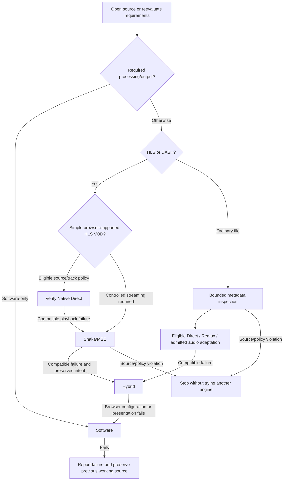

<!-- SPDX-License-Identifier: CC-BY-4.0 -->

# Automatic playback selection

`new Player(host)` now selects the route automatically. The actual engine is still
one of **Native, Hybrid or Software**; automatic selection is a policy, not a fourth
mode. Explicit `mode` options retain the previous manual contract.

```ts
const player = new Player(host);
await player.open(file);                    // Inspect and select a working route.
await player.play();
console.log(player.mode);                   // native | hybrid | software
console.log(player.diagnostics.selection);  // Selected, skipped and failed attempts.
await player.setVideoFilters('hflip');       // Automatically reopen in Software.
await player.setVideoFilters('');            // Reevaluate the cheaper eligible routes.
await player.setMode('hybrid');              // Pin Hybrid, including future opens.
await player.setAutomaticSelection();       // Resume automatic selection/reselection.
```

`automaticSelection: true` explicitly enables the policy even when a `mode` option
is present. `automaticSelection: false` keeps manual selection. The demo and minimal
example expose a separate Automatic selection checkbox alongside the three modes.



## Selection and recovery

- Every new source starts at Native eligibility again, even if the previous source
  needed Software. CPU filters skip directly to Software.
- For ordinary files, bounded JavaScript metadata or a packet-only FFmpeg probe
  discovers tracks before accepting Native. Enabled
  embedded subtitles require mpv rendering. For the admitted local Matroska
  SubRip/ASS/SSA/PGS/VobSub or MP4/MOV mov_text subset, an independent
  subtitle-only mpv service can pair with Native Direct or Native Remux. It
  never becomes the A/V decoder: `mpvSubtitles.avChains` must remain zero.
  The optional service assets must answer a preflight availability check.
  Automatic subtitle selection follows the inspected file-default stream,
  and a selected stream must produce a real overlay at the current time or
  at one of 0, 1, 2, 5, 10, 20 or 30 seconds. If it does not, the
  candidate falls through to Hybrid/Software. An unobserved first cue therefore
  conservatively keeps the full mpv route.
  Direct is preferred when the original browser source works; Remux remains an
  A/V packaging decision. Ineligible embedded tracks retain Hybrid/Software.
  Audio eligibility considers the selected
  track rather than rejecting a file for every unused track. Missing codec mappings
  and negative `canPlayType()` hints do not reject unchanged Native playback.
  A transactional candidate must establish decoded current-data readiness.
- Native remux now attempts the [broader browser MP4 packet contracts](BROAD-ROUTING.md). No audio or video transcoding
  is introduced. Hybrid and Software retain their existing decoder/resource limits.
- Hybrid must deliver an actual retained frame; a browser capability probe alone
  is insufficient. A rejected Hybrid candidate automatically proceeds to Software.
- Successful replacement preserves position, pause/play intent, volume and rate.
  Automatic transitions preserve proven track identities. File paths can map source
  stream indices; Shaka track identity is backend-scoped and is never guessed
  across a transition to FFmpeg.
  Transitions reject if that identity cannot be preserved; disabled audio/subtitle
  selections remain disabled. Explicit manual mode changes retain their ID-reset contract. If all candidates fail while opening a new source,
  the previous working player is retained.
- A later ordinary-file Native Direct decode failure tries qualified Native remux
  before Hybrid. Adaptive-source failures reject that execution plan and try the
  next eligible streaming backend; file remux is never a manifest scheduler.
  A later Hybrid decoder failure proceeds to Software. Each failed session can
  schedule recovery only once; failures on a replacement are rechecked after the
  active recovery completes, so recovery proceeds forward rather than looping.
- Seek failures may proceed to the next engine at the requested target. Invalid
  seek requests reject without fallback. Enabling subtitles after opening with them
  disabled reevaluates Native eligibility. Automatic CPU-filter changes reevaluate
  the route as well.
- Source transport, authorization and representation failures stop the chain.
  Fallback must not replace an ETag-protected session with a new reader that silently
  accepts a different file. File range retry logic and Shaka networking retries
  retain their respective transport ownership.

`selectionchange` reports individual skipped, failed and selected routes. The bounded
`diagnostics.selection.attempts` list explains the latest selection operation.
`modechange` continues to report candidate loading, failure and readiness, and `mode`
continues to name only the active engine. Automatic filter capability flags indicate
that requesting a filter can trigger an engine change.

## Costs and limits

Deep ordinary-file automatic inspection loads the remux FFmpeg Wasm module and uses two temporary
workers even when Native direct eventually wins. It performs no audio/video decoding
or encoding and terminates those workers after inspection. This adds startup work;
no new CPU-performance advantage is claimed. The local MP4 fast path below avoids
this work when its bounded metadata checks pass. **Explicit Native without
admitted embedded subtitles retains the Wasm-free direct path.** Deep inspection requires cross-origin isolation,
source permissions and the existing bounded HTTP Range contract (or a local File).
A server that cannot satisfy range inspection may require explicit Native playback.

Destruction interrupts module-import waits as well as active probe work.
The probe has a 20-second deadline and the existing bounded source/demux budgets.
Unknown codec/profile mappings remain unknown until the runtime attempt. When metadata
inspection is unavailable for a non-transport reason, Native is skipped and mpv
routes are attempted. HLS/DASH classification bypasses the ordinary-file probe.
A simple browser-supported HLS VOD source can try Native Direct; controlled
adaptive execution uses the lazy Shaka/MSE backend. Browser output is verified,
and an eligible FFmpeg fallback must preserve quality, track and source policy.
Explicit Native pins the Native family, including Shaka; it does not force every
manifest into browser-direct playback. Shaka requires no Demuxe Wasm or isolation.
See [the streaming contract](STREAMING.md).

External browser WebVTT tracks cannot yet transfer to mpv through this API. Automatic
selection therefore rejects a route that would discard them rather than pretending
it preserved subtitles. Native track APIs, mpv-specific track IDs, multichannel output,
HDR, PiP/remote destinations and exact color handling retain the limitations in the
[capability contract](MEDIA-ROUTING.md). This selector does not add new output fidelity
or codec guarantees. Local Files now use bounded reads in all worker-backed routes, including fallback
to Hybrid or Software above 32 MiB. The ArrayBuffer API remains size-limited.

The metadata preflight remains conservative about uninspected track semantics;
codec mappings constrain packet construction, not Native direct compatibility. Language preference negotiation, track mapping when source stream identity is
unavailable, and audio-only conversion remain separate work.
Unsupported explicit track requests continue to reject; automatic selection does
not guess a different language or silently drop requested external subtitles.

## Implementation and validation

- `src/unified-player.ts`: policy, ordered attempts, transactional commit, recovery,
  explicit pinning, filter/subtitle reevaluation and cancellation.
- `src/internal/selection.ts`: selected-track Native and simple HLS eligibility.
- `src/internal/shaka-backend.ts` / `shaka-network.ts`: adaptive execution adapter
  and source policy through Shaka networking hooks.
- `web/resource-loader.js`: unchanged-resource transport for narrow FFmpeg fallback;
  it contains no manifest scheduler or rendition rewriting.
- `web/source-probe.js`: temporary worker ownership, metadata deadline and cleanup.
- `native/remux/remux.c` / `web/native-remux-worker.js`: packet-only `rm_probe`, sharing
  the existing source adapter and FFmpeg module without requiring decoders.
- `web/native-remux-player.js`: source-error provenance retained for terminal failures.

```sh
npm run build
DEMUXE_REMUX_FFMPEG_DIR="$PWD/build/pipeline-qualification/ffmpeg-remux" npm run build:remux
npm run test:automatic-selection
npm run test:api
npm run test:remux-regressions
```

[Recorded checks](../results/automatic-selection/README.md) distinguish successful
playback tests, injected runtime-error policy tests, and remaining qualification limits.

## Beta startup fast path

Simple local MP4 files first undergo bounded JavaScript box inspection (at most
256 KiB movie metadata plus 2 KiB headers, 64 top-level boxes). Filename/MIME are
ignored. A single AVC video track and optional AAC-LC mono/stereo track must have
self-contained data references and known sample entries. Browser hints do not
affect this metadata fast path.
Additional tracks, encryption, multiple sample descriptions, unfamiliar metadata or larger
indexes retain FFmpeg inspection. Actual Native playback still gates selection.
Ordinary remote files retain the existing FFmpeg/source-identity path; no permission or
authentication handling is bypassed. Explicit Native direct already avoids both
inspectors and Wasm, and is checked separately in the clean consumer test.

This optimizes a deliberately narrow implemented case, not every MP4 or every
automatic Native selection. See `web/simple-mp4-inspector.js` and
`tests/simple-mp4-inspector.mjs`. No additional public mode or codec transformation is added.

## Source/session runtime evidence

See [runtime capability discovery](runtime-capability.md) for the finite plan order,
readiness evidence, failure classification, session cache and regression commands.
`diagnostics.runtimeCapabilities` distinguishes untested, probing, verified and
failed plans separately from semantic eligibility.
