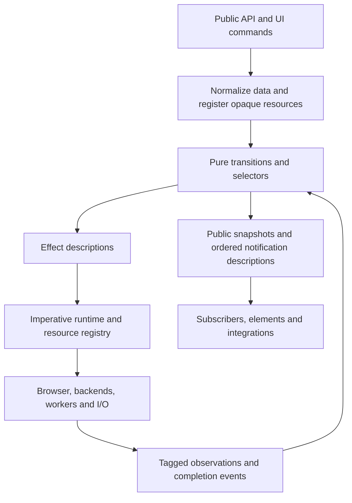

# Functional core and imperative shell migration plan

Date: 2026-10-02. Reviewed source: local `main`, `6e17c428`.

Status: implementation is progressing on local `main`. Local builds and tests were authorized on 2026-10-02. Baseline generated outputs are committed at `092445fe`; projection, telemetry and presentation are committed at `e15b1466`; composed operation/source/playback, preview, binding/control and byte-reader ownership is committed at `287f1a0d`. Settings transactions, the remaining UI owners, provider orchestration, local reader policy and bounded diagnostic traces are committed at `128fef5d`. Filter/tone and range/loop transactions, pure resource/executor metadata, HTTP reader/resource-loader policy, backend request lifecycles and private-audio control are committed at `c89ce97e`. Composed routed-track policy, stable selection identity, private PCM admission and remux lifecycle policy are committed at `6f998d6d`; provider asset-root compaction is committed at `c3eb9c90`. Attachment transactions, private audio-worker lifecycle and native MSE-worker request/source identity are committed at `2883d21f`. Immutable route admission and history, private playback-worker control and remux-controller ownership are committed at `bf657b48`. Inspection/discovery, retained presentation and MSE buffering/scheduling are committed at `25b2c136`. The eighth checkpoint, `cf01f572`, composes route evidence, promotion and recovery, decoder/mailbox ownership and MSE startup/output policy; its final build and maintained contract gate pass. The ninth checkpoint, `af565b60`, adds composed watchdog ownership, remux producer policy, versioned native retained-frame release and software preview metadata readiness; its full build and maintained contract/type gate pass, with native Wasm/browser qualification still pending. The tenth checkpoint, `2b677280`, adds composed publication/statistics and output dimensions, Native startup/seek policy, the lower WebCodecs decoder lifecycle and Wasm RPC/open/waiter ownership. The eleventh checkpoint is in progress: Player media actions, remaining backend orchestration and native pressure qualification. No PRs or pushes are part of this task. Later milestones remain open until their ownership and qualification gates pass.

## Implementation progress

| Phase | Implemented | Remaining gate / next work |
| --- | --- | --- |
| 0: baseline and compatibility | Baseline builds, package compilation, 721 contracts and consumer types passed. Packaged `287f1a0d` passes all 12 browser groups: 342 structured checks plus ten preview scripts. Current application wrappers and Shaka are packaged with hash-verified original native engines; frozen source, harness and runtime hashes retain exact provenance. | The original baseline Firefox paused-frame failure remains unexplained; the candidate passed that sequence without establishing the old failure's cause. Later source changes need fresh candidate packaging/qualification. Reused native engines are not a fresh engine build or release qualification. |
| 1: foundation | Scoped effect/outcome data, immediate/scheduled interpreter, bounded resource registry, virtual scheduler and pure-module guard. Pure registry/interpreter transitions now own admission, scopes, retirement, delivery and cleanup accounting. Cleanup deadlines distinguish detached resources from physically released resources and retain late outcomes. Production Player has a bounded, sanitized internal transition trace; deterministic simulated replay and shrinking detect an identity-check mutation. | Extend typed adapters and integrate runtime/resource ownership with Player. Sanitized trace omissions cannot reconstruct private source/filter/attachment effects; full composition replay remains open. |
| 2: observation/projection | Pure public/media/capability projections, explicit-time statistics and watchdog transitions are integrated. Reentrant capture/publication is fenced. Session observations retain allocation identity, reject stale ordering and stop error/recovery effects after retirement. | Player monitor policy, lease, activity epoch and progress sampling now share the composed boundary; physical timer handles remain in the shell. Publication snapshots, statistics, errors and operation timing now share that boundary; output dimensions are an atomic preference. Remaining gates are the candidate browser matrix, allocation measurement, remaining diagnostics policy and removal of direct backend reads from accepted observation storage. |
| 3: operations | One composed Player transition owns queue admission/retirement, terminal state, play intent cancellation, latest seek supersession and observation identity. Promise/controller handles remain in the shell. Source acceptance atomically commits settings and playback reset. | Replace remaining command closures and temporary readers with typed effects; extended replay/resource accounting and real output continuity qualification. |
| 4: source and routing | Explicit candidate phases reject cancellation before subsequent stage I/O; acceptance allocates separate source/session identities. Retired accept observers cannot publish readiness or show a surface. Capability evidence and bounded tier histories use pure transitions; the finite plan registry and feature admission now reside inside the checked pure boundary. | Immutable source-policy functions, route overlays and bounded attempt history now share that pure boundary. Inspection metadata and initial/fast/optional policy, discovery cursor and attempt leases, caption exclusion and one-shot Direct restoration are now composed. Route evidence, promotion and recovery now share the composed Player boundary. Complete initial inspection orchestration, typed candidate effects and complete resource retirement. |
| 5: settings | Composed transactions own pending and accepted volume/mute/rate/gain/pause, direct tracks with verification, buffering, output device and quality changes. Failures compensate and failed compensation records session degradation; retirement settles even ignored backend work. Timing/style remain private until atomic source acceptance. Acceptance merges only owned fields, retaining independently accepted emergency pause. Filter/tone requirements, exact compensation and promotion requests are pure. Range/loop validation, position verification/compensation and automatic boundary phases share the composed Player authority. Routed track and subtitle visibility decisions, host track policy and stable selections now commit at that same boundary. Attachment identity, budgets, pending/accepted membership and removal policy share source acceptance; byte/URL/handle objects stay in the adapter. | Complete requested/selected/presented streaming ownership. Audit remaining temporary preference setters and pure route requirements. |
| 6: preview | Pure request/coalescing/caller/job identity, pressure, budgets/cache metadata, source/provider revisions and pregeneration policy integrated. Reentrant abort/clear, stale timeouts and stale returned frames have regression histories. | Packaged candidate browser qualification, final resource accounting and production replay integration. |
| 7: presentation and consumers | Presentation/leases, binding/MediaView, element connection/queue/control state, advanced drafts, Video.js exclusive host lifecycle, element configuration/render policy and scrubber lanes now have pure owners. Focused UI compatibility checks pass 51/51; earlier advanced positive and negative browser controls pass. | Browser qualification of the latest Video.js/configuration/scrubber changes and final ownership audit. |
| 8: I/O and backend policy | ByteReader, provider acquisition/preparation/runtime, qualification/probe decisions and local-file admission/cache metadata now use pure transitions. Job promises are installed before reentrant callbacks/I/O; original error/Promise identity and weak source association are preserved. Local-file 64-bit offsets, returned views and post-cleanup retirement retain existing contracts. HTTP range/resource-loader transitions now own identity, deadlines, retries, admission, byte/request accounting and cache metadata. Backend request transitions own pending RPCs/closing/deadlines. Private audio owns intent, context observation identity, EOF, readiness and bounded drift policy. PCM owns reset/ack epochs, posted/consumed bounds and stop deadlines. Remux owns source/restart/generation lifecycle, one-shot recovery and packaging retry admission. Private audio-worker init/load/control/close, native MSE-worker boot/shutdown/request epochs, and source-specific authorization replies now have pure ownership. | Private playback-worker lifecycle, commands, presentation fences and adaptive policy, plus remux-controller acquisition/request/retirement, now have pure owners. Retained frame admission/selection/deadlines and MSE pull/append/eviction/window policy have pure owners in the seventh checkpoint. Retained decoder/mailbox and MSE negotiation/output now have pure owners. The ninth checkpoint adds versioned native final-reference release acknowledgments and lower remux producer protocol/budget/delivery policy. The bridge preserves existing mpv image metadata through copies and native references; matching Wasm ownership and browser progress qualification remain open. Native verification/seek, the lower WebCodecs wrapper and Wasm initialization/RPC/open/waiter ownership now have pure owners. Remaining work includes Native load/track orchestration, Wasm seek/settings, Shaka, cooperative scheduler/range-source state and residual Demuxe backend policy. Physical buffers, fetches, workers and media engines remain in adapters. |
| 9: final qualification | Static pure-source guard and maintained contract/browser harnesses are in place. | Complete ownership inventory, safe bounded trace/replay/shrinking, cleanup containment, mutation/coverage and performance/package/browser gates. |

The first cutover passed 752 contract tests and consumer type checks (`results/api-stability/gate-unit-all-node-1790956194625`). The next checkpoint passed 861 contracts before final retirement regressions were added (`results/api-stability/gate-unit-all-node-1790958407336`). Advanced positive and negative results are recorded under `results/api-stability/advanced/` and `advanced-negative/`; the negative controls exposed and led to fixing controls left disabled after a source change during an output-picker request. Browser matrix provenance is recorded in `results/api-stability/baseline-runtime-1790955136418/matrix-status.json`; those baseline results describe `092445fe`, not subsequent application changes.

The final checkpoint build, license/core boundary checks, player-package compilation and **868/868 contracts plus consumer types** passed (`results/api-stability/gate-unit-all-node-1790959390942`). The earlier `1790959251211` run overlapped TypeScript output generation and hit a partially written module; it is invalid validation evidence and was replaced by the run after build completion. No build may run concurrently with tests reading its generated output.

Publication compatibility corrections and exact observer behavior are recorded in the [compatibility ledger](FUNCTIONAL-CORE-COMPATIBILITY.md). The source boundary guard is a static safeguard, not proof against arbitrary aliases or hidden effects. The projection wiring comparison now tests adapter consistency; independent expected-value and reentrant-delivery tests provide the behavioral oracle.

The second checkpoint passed **977/977 contracts plus consumer types**, a full build/license check (54 core source/output files), and player-package compilation (`results/api-stability/gate-unit-all-node-1790961847580`). Review added regressions for synchronous retirement returning a rejected physical promise and delayed volume acceptance overwriting an independently accepted emergency pause. Both are fixed. Trace retention/privacy, simulated replay/shrinking, cleanup timeout/late-result and provider reentry regressions are part of the maintained gate.

The third checkpoint passed **1,124/1,124 contracts plus consumer types**, a full build/license check (63 reusable core source/output files), the static pure-boundary guard, and player-package compilation (123 sources, 151 outputs). The maintained report is `results/api-stability/gate-unit-all-node-1790963915867`. Four source-package recovery tests verify relocated native inputs against original hashes; CI includes that regression suite. Review reproduced and fixed a delayed AudioContext acknowledgment resuming video after a newer suspension. Request accounting begins only at physical fetch invocation, and automatic boundary ownership lasts through queue publication. The first full run exposed an obsolete constructorless fixture that replaced physical handles without accepting a new core source identity; it was corrected without weakening its stale-action assertion, and the full gate rerun passed.

The fourth checkpoint passed **1,212/1,212 contracts plus consumer types**, a full build/license check (66 reusable core source/output files), the static pure-boundary guard and player-package compilation (127 sources, 155 outputs). The maintained report is `results/api-stability/gate-unit-all-node-1790965082026`. Track tests cover pending versus accepted stable identity, backend ID remapping, host locks, visibility, stale inventory and cleanup failure after source acceptance. PCM tests retain exact ring-copy samples while checking reset acknowledgments, deadline/reentry failures and bounded admission. Remux review found and fixed duplicate video-frame cancellation; cleanup now cancels exactly once even when listener removal throws. Browser qualification of the separately frozen `c89ce97e` package is still in progress and does not qualify this fourth checkpoint.

The fifth checkpoint passed **1,295/1,295 contracts plus consumer types**, a full build/license check (66 reusable core source/output files), the static pure-boundary guard and player-package compilation (130 sources, 158 outputs). The maintained report is `results/api-stability/gate-unit-all-node-1790966136600`. Focused gates passed 128 attachment/track/source contracts, 70 private-audio/PCM contracts and 61 remux contracts. Twelve attachment model seeds each cover 100 mixed add/remove/failure/close/reopen steps. The first full run failed six obsolete fixtures that assigned the removed attachment arrays; the fixtures now use initial core ownership, their existing assertions remain intact, and 31 focused plus the full rerun passed. The separately frozen `c89ce97e` browser matrix completed with 10/12 groups and 340/342 structured checks passing. Chromium and Firefox each failed a Hybrid paused-pixel sequence; the original reports remain failed qualification evidence.

The sixth checkpoint moves all five source-policy functions unchanged into the pure boundary and composes immutable route overlays, attempt history and session-fenced capability answers with Player state. Private playback owns init/load/close stages, command and refresh deadlines, presentation mailbox/fences, subtitle inventory and adaptive decode evidence. Remux controller owns acquisition, boot/fallback, requests, source identities and retirement; physical engines, frames, promises and ports remain in adapters. Review covers reentrant acquisition and teardown, scheduler failure before native calls, and late subtitle completion. After those fixes, **1,379/1,379 contracts plus consumer types** passed (`results/api-stability/gate-unit-all-node-1790967783729`), along with the full build/license boundary (72 reusable core source/output files), static pure-boundary guard and candidate player-package compilation (137 sources, 166 outputs). The earlier 1,371-pass run preceded the hardening regressions and is superseded by this final gate.

The `c89ce97e` browser receipts are in `build/local-functional-next-candidate/qualification-provenance.json`: 796 application files, 831 harness files, three fixtures, 36 package archives, ten rebuilt wrapper/provider records and 612 assembled asset outputs plus the embedded output retain verified hashes. Exact replay traced Hybrid pause failures to two or three trailing pictures after pause completion, followed by stable clock/pixels. The pre-migration `092445fe` Hybrid replay reproduced the same ordering failure. A real worker regression holds bitmap delivery pending and verifies that pause waits for its final UI presentation acknowledgement. The correction also keeps the snapshot canvas stable while servicing native commands, and nonvisual volume/speed/cache changes cannot reopen paused rendering. An isolated minimal worker patch passed 12/12 Chromium exact-sequence replays with unchanged assertions. Its Firefox replay passed 11/12, with no paused-picture failures but a separate playing-progress failure. This is diagnostic evidence, not qualification of the final extracted worker. Enhanced unpatched Firefox replay also reproduced playing-output failure with a deadline error and a frozen clock/surface; the exact deadline is under investigation and the generic `NETWORK_TIMEOUT` code does not establish a network cause for this local-file fixture. The older Firefox Auto/native-direct failure is distinct and remains unexplained. Stable paused pixels do not establish exact frame PTS or media fidelity.

The seventh checkpoint composes source-keyed inspection metadata, assets and opaque failure identity with Player routing. Physical file and error objects remain in a bounded adapter registry. Canceled candidate opens restore prior source metadata and assets, while close/destroy cannot rebind rollback to a newer epoch. Pure discovery state owns the finite cursor, unique attempt leases, lazy optional-probe decisions, caption exclusion, fast-to-full restart and one full-budget original Direct retry; raw errors and I/O remain in the shell. Retained presentation owns generation/seek/PTS admission and draw deadlines, and remux lifecycle composes pull/append receipts, byte metadata, EOF, pump/eviction decisions, buffered seek and window resume. After independent review, **1,507/1,507 contracts plus consumer types** passed (`results/api-stability/gate-unit-all-node-1790969688411`), along with the full build/license boundary (72 reusable core source/output files), static pure-boundary guard and candidate player-package compilation (142 sources, 171 outputs). Focused gates passed 75 routing/inspection, 92 retained-playback and 121 remux tests. The first full run exposed a constructorless remux fixture missing its sampled media element; that fixture and the EOF fixture now initialize the owned state layout without weakening their assertions. The full rerun includes the maintained decoder, mailbox and EOF suites. Checks that overlapped an earlier output-stamping stage or used stale generated files are superseded by these runs after build completion.

Firefox diagnostic replay identified the separate playing failure as `Retained presentation frame budget`, with 16 retained frames and no source/decoder timeout. The public timeout code was caused by matching `setTimeout handler` in the appended Firefox stack; classification now examines message/cause facts while retaining the redacted original diagnostic message. Bounded decoder backpressure retains the seventeenth frame in its existing queue until presentation releases capacity, without raising the 16-frame limit or rebuilding native engines. Actual native/browser pressure progress remains a qualification gate: simulated scheduler tests alone do not exclude a native retry loop. The maintained sequence harness now records measured output and bounded sanitized failing state before assertions/disposal; thresholds and sequence actions are unchanged. Provider packaging exposed a separate SPDX-only collision between cached generated machine modules and compiler output. All ten affected provider profiles now list those modules as generated from TypeScript, so compiler provenance is authoritative. Nine asset-graph/compiler-provenance regressions pass, including deliberate stale cached output; the licensing CI gate includes them. Frozen browser candidates retain their own source/hash receipts and explicit packaging overlays; those runs do not qualify untested current source changes.

The frozen `bf657b48` browser matrix is recorded in `build/local-functional-checkpoint6-candidate/qualification-provenance.json`: **10/12 groups**, 342 structured checks and 30 suite processes. Both seeded browser sequence groups pass. Original failures remain a Firefox content-process native crash during component UI testing and a Chromium positive software-preview request returning `null`. Separate unchanged Firefox UI and Chromium software-preview reruns passed; their receipts are in `diagnostics/isolated-reruns/result.json`. These reruns do not replace the failed matrix or establish the causes. Verified provenance includes 829 application files, 840 harness files, three fixtures, 36 archives, ten native-provider origins, 645 assembled assets and one embedded output. Packaging required explicit metadata overlays to compile machine modules from source and remove a cached range-reader output from `playerCoreSources`; original rejected archives/configurations are retained. The package compiler now rejects cached generated source-list inputs, and the asset-graph/compiler-provenance regression gate passes 9/9. Reused native binaries and the embedded output remain subject to the existing qualification limits.

The eighth checkpoint moves capability evidence, negative retry history and identity allocation into Player routing. Physical source WeakMaps remain adapters, while explicit revisions reject facts captured before source/operation retirement. Promotion owns timer deadlines, queued inspection and actual handoff identity; recovery owns one-shot accepted-session leases and bounded source-specific streaming exclusions. Remux recovery requirements travel explicitly through inspection/admission/discovery/replacement rather than changing the configured Player policy. Root routing tests pass **61/61 in an isolated TypeScript output tree**, followed by **102/102 routing/inspection**, **121/121 decoder/mailbox** and **175/175 remux** checks against stable generated outputs. The first build exposed a missing reusable-core dependency declaration for route evidence; that manifest is corrected (75 core source/output files). The final coordinated build/license check, static pure-boundary guard, candidate player-package compilation (149 sources, 179 outputs), and **1,607/1,607 contracts plus consumer types** pass (`results/api-stability/gate-unit-all-node-1790971602922`). The initial 1,606/1,607 run (`1790971544140`) found one legacy fixture asserting temporary mutation of configured remux policy. That fixture now requires the explicit forced-remux request while asserting stable configuration; its position and full-output-verification assertions remain intact. The 25 readiness tests and the full gate rerun pass. A former test reading a removed private cache store now checks exact remembered-source behavior through the adapter; pure tests retain exact storage bounds. Review also corrected terminal pause callbacks emitting a retired error and evidence callbacks committing under a newer cache revision.

The native pressure experiment preserves three distinct results. Default 16-frame Firefox replays passed 12/12 but never exercised backpressure (retained peak eight), so they do not prove saturation progress. A separately hashed four-frame canary reproduced a native retry loop and frozen output. Parking the receive continuation eliminated the loop but still exhausted its deadline; that reduced limit may be below native seek lookahead. The final diagnostic propagates the deadline as an explicit worker/Player error and rejects seek instead of exposing advancing audio time with frozen video. It released 134/134 retained frames and left zero scheduler work or decoder requests. This establishes bounded failure/cleanup at the canary limit, not successful playback or progress at the production limit. Current source classifies the exact retained-decoder request deadline as `DECODE_FAILED`; native-output uncertainty and source/network deadlines retain their existing timeout semantics. Seven classification tests pass, but the frozen diagnostic used the older classification. Native timing-frame retirement/pressure ownership remains under investigation; thresholds and output assertions are unchanged.

The packaged `287f1a0d` matrix and exact hashes are in `build/local-functional-candidate/qualification-provenance.json`. It checks asset delivery on Chromium 145.0.7632.6 and Firefox 146.0.1 with reused immutable native engines. Unsupported browser presentation capabilities are checked as unsupported, not treated as successful presentation. This matrix precedes the second checkpoint changes and does not qualify them.

The ninth checkpoint passes **1,666/1,666 contracts plus consumer types** (`results/api-stability/gate-unit-all-node-1790973407316`), the complete build/license gate, the 75-file reusable core boundary, static pure-module guard and in-memory package compilation (151 source inputs, 181 outputs). New maintained histories comprise 15 watchdog cases, 20 remux producer cases, 13 native-lease adapter cases and eleven preview readiness cases. The same-lease timer acquisition/cleanup regressions fail against the pre-fix behavior and pass with the final adapter. Native host clone/copy/final-unref tests and metadata-preservation review passed; these do not qualify the optional versioned Wasm bridge or prove media progress. Production limits remain 16 retained presentation frames and 32 decoder frames.

The ninth checkpoint also traces the intermittent null software preview to metadata delivery: Firefox presentation completed, the provider read an empty track list, and the video track metadata arrived 0.24 ms later. The bounded metadata wait fixed that history in 60/60 exact-fixture Firefox trials and both browser software-preview suites. A separate aspect-ratio diagnostic then found 3/20 previews at 160 by 90 instead of the source-correct 160 by 120 because video dimensions arrived after the track list. The same bounded wait now requires valid dimensions for video while confirmed audio-only sources remain immediate; eleven controlled readiness histories pass. The combined track/dimension fix passes both full browser software-preview histories and 30/30 exact-fixture Firefox repetitions with correct 160 by 120 output and zero remaining preview iframe owners. `build/local-functional-checkpoint6-candidate/diagnostics/preview-geometry-fixed/verification.json` binds the 645 runtime outputs and browser versions. This evidence covers `bf657b48` plus the isolated two-module readiness delta, now included in `af565b60`; it does not qualify the entire ninth or tenth checkpoint. Original failed matrices and diagnostics are retained; passing reruns do not replace them.

The tenth checkpoint composes publication scheduling, capture/commit revisions, source statistics, session errors and operation timing into Player. A snapshot and its first-playing statistics commit atomically before subscribers run; schedule-only reentry does not invalidate captured domain data. Output dimensions commit together and survive unrelated setting acceptance and close. Native owns verification and seek phases under its existing source epoch; raw timers, frame callbacks and promises remain in the shell. WebCodecs owns decoder acquisition/retirement and the eight-packet admission limit. Wasm owns initialization, bounded RPCs, open leases, file presence and event-waiter identities; logical retirement precedes cleanup/settlement. Negative controls reproduce the previous RPC leak after a throwing message send and sibling event-waiter leak after failed open. Independent review added sampled-clock deadline rearming, cleanup-safe settlement and cross-domain Native completion rejection. The build/license gate, 75-file reusable core boundary, static pure-module guard and in-memory package compiler pass (155 source inputs, 185 outputs). The complete gate passes **1,768/1,768 contracts plus consumer types** (`results/api-stability/gate-unit-all-node-1790974601536`). Its first run found four timing fixtures still assigning the retired writable Wasm field; those fixtures now initialize/retire the actual pure lifetime and retain all coalescing assertions. A fresh native baseline/candidate pair also passes real Asyncify and JSPI clone/copy/final-unref and metadata-preservation probes; its sealed dependencies and artifact hashes are recorded in the external `demuxe-functional-native-lease-20261002/native-pair-receipt.json`. The paired baseline matches current root Asyncify bytes, but differs from the original frozen CI engine. The first candidate compile exposed a copied-file header lookup error; the linker now includes the sealed mpv video-header directory. These checks do not establish current browser output or native pressure progress.

The eleventh checkpoint is in progress. Frame stepping, snapshots and live navigation now use composed action identities and typed effect descriptions. Player presentation verification has a composed owner for candidate/accepted session identity, output sampling, confirmation, the existing 25-second deadline and 25-ms poll. Seventy focused pure/adapter histories pass in isolated outputs, including cancellation in each phase and method/observation getters that retire the session. The previous implementation invokes confirmation after a diagnostic getter retires its session; the new regression fails there and passes after extraction. Snapshot option capture preserves inherited/non-enumerable known fields, ignores unrelated getters and retains queue-time reads. Wasm seek observations join its existing lifecycle reference, including atomic source/reset retirement. Private software source/playback/control leases now fence late play, refresh, frame-draw errors and settings observations; 30 focused checks pass, including 17 new histories. Native load and track changes now own phase/rollback/source URL authority and join captured cleanup before reusing the media element; 129 focused checks pass, including 25 new histories. Shared Shaka runtime loading now has a pure consumer/load/cache owner, with 13 focused tests and independent reentry review. A controlled baseline reproduces duplicate fetch during synchronous acquisition reentry; cleanup regressions also fail before and pass after the extraction. The full build/license check, 75-file reusable core boundary, static pure-source guard and in-memory package compiler pass (162 source inputs, 192 outputs). The final maintained gate passes **1,901/1,901 contracts plus consumer types** (`results/api-stability/gate-unit-all-node-1790975768890`); the separate decoder architecture gate passes 6/6. The first full run found one buffering fixture assigning the removed private pause field. It now initializes the real pure backend owner and retains the same exact throttle-reset command assertions. No output/browser qualification is implied for the full eleventh checkpoint.

The native paired diagnostic is sealed in `build/local-functional-native-lease-pair/qualification.json` (SHA-256 `e2cd3f797391dd68baab862bbdf829cbe0eb44f3b59f8efab365dedf746a1f0a`). All 2,592 outputs across four variants and ten browser reports were verified. With identical bridge/timer code and sealed native dependencies, the fresh baseline fails at capacity four with a decoder deadline while the lease candidate passes five stress histories; four Firefox histories show actual blocking followed by native release and resume. The candidate also passes eight default-capacity histories; the baseline passes two. Default-capacity runs do not exercise blocking. Fourteen cleanup replies report zero remaining native/frame/source/request/scheduler owners. Firefox testing first exposed a mailbox timer receiver error in both variants; a bound global-timer default and receiver-sensitive negative control fix it, with original failure receipts retained. This qualification deliberately uses the frozen `bf657b48` caller with the `af565b60` bridge plus the timer fix and diagnostic native exports; it is not current whole-application or production-export qualification. Production links and latest package/browser gates remain open.

The registry now contains uncooperative cleanup with a deadline and records detached versus physically released resources, and its logical metadata now has a pure owner. Production Player integration is still open. The generic interpreter is not yet Player's command executor; isolated runtime tests and the limited sanitized trace do not establish complete migration.

## Objective and boundary

Move every application-owned playback decision and logical state transition into deterministic functions. Keep the public API stable. Make command histories, failed operations, cancellation, late completions and resource retirement reproducible without a browser.

Use **one composed player state machine and one atomic transition boundary per player**. Operations, source acceptance, routing, settings and playback are pure domain functions within that composition. They do not have independent mutable stores, event loops or independently published intermediate states. A source acceptance updates its source/session, settings and playback intent together before effects and notifications become visible.

Separate state-machine owners follow real lifetime or authority boundaries: the player's restricted preview lane owns thumbnail work, the optional element owns its queue and editing drafts, and document-level presentation arbitration owns shared browser leases across players. A preview owner cannot emit playback route/source effects; UI playback values are derived from the player. Each logical value has one authoritative writer. Test the composed player across commands and completions as well as its individual functions.

Browser media engines, FFmpeg/mpv, WebCodecs, audio worklets, network connections and DOM nodes retain physical execution state. They report observations to the functional machines. We do not represent physical playback as if a successful command proved that frames or audio were produced. Implementation-private buffers and handles remain mutable inside their owning adapters.

The target therefore covers **all Demuxe-owned control state**, including scheduling and retry policy in I/O adapters where Demuxe owns those decisions. It does not require rewriting third-party decoder internals or copying frame/sample buffers through immutable application state. Lower-level transport and renderer scheduling use small local pure machines when needed; they do not send every packet/sample through the main player reducer.

## Current architecture and extraction seams

Paths and symbols below refer to the reviewed source; line numbers may move.

| State domain | Current owner and coupling | Target authority / imperative responsibilities |
| --- | --- | --- |
| Playback intent and observed status | `src/unified-player.ts`: `settings.pause`, `observedPlaying`, `observedWaiting`, backend `properties`, `publish()` | Playback machine owns intent and accepted observations; backend adapter samples properties and reports tagged events. |
| Commands and cancellation | `Player.enqueue`, `playRequests`, `latestSeek`, `operationEpoch`, `activeOperation`, queue counter | Operations machine owns admission, ordering, supersession and outcomes; shell owns promise resolvers, abort controllers and physical queue execution. |
| Sources, candidates and route handoff | `Player.select`, `replace`, `create`, `current`, `candidate`, `sourceSerial`, `sourceInspection` | Source/route machine owns candidate phases and acceptance; shell creates, prepares, attaches and destroys resources. |
| Route eligibility, fallback and promotion | `playback-plans.ts`, `selection.ts`, `execution-recipes.ts`, `tier-policy.ts`, `runtime-capability.ts`, promotion timers in `Player` | Pure admission/selection policy plus explicit attempt/evidence state; shell performs inspection, probes, capability queries and timer scheduling. |
| Settings and media controls | `Player` fields for filters, gain, timing, output device, tracks, quality, loop, range and attachments | Settings machine owns requested, pending and committed values, reset scopes and rollback. Backends apply commands and return acceptance or observations. |
| Buffering, statistics and recovery | `buffering.ts`, `watchdogs.ts`, `playback-statistics.ts`, `startWatchdogs`, `recover`, `enforceBoundary` | Pure policy, sampled-progress transitions and bounded counters; shell supplies explicit timestamps, visibility changes and output samples. |
| Preview work and cache policy | `preview/controller.ts`, `pregeneration.ts`, `player-preview.ts` | Preview machine owns job selection, pressure, cancellation and cache metadata. Shell owns providers, blobs, bitmaps, timers and caller callbacks. |
| Presentation and shared ownership | `presentation.ts`: fullscreen/PiP epochs, pending flags, module-level Media Session owner | Presentation machine and document-scoped lease arbiter own requests/lifetimes; shell owns windows, DOM restoration markers, browser calls and subscriptions. |
| Player element and advanced controls | `player/index.ts`, `advanced-settings.ts`, `player/preview.ts` | Element machine owns queue, drafts, menu/seek gesture state and action lifetimes. Shell renders DOM and reads browser geometry/focus. Playback values are selected from the player state, not copied into another authority. |
| Consumer adapters | `integration/index.ts`, `media-element/index.ts`, `adapters/videojs.ts`, `integration/media-view.ts` | Binding/element lifecycle machines own disposal and pending intent. Shell owns listeners and framework instances; borrowed bindings never acquire source ownership. |
| Providers and source transport | `sources.ts`, `provider-runtime.ts`, `provider-acquisition.ts`, `engine-preparation.ts`, `web/range-reader.js`, source bridges | Local machines own request budgets, generations, retries and retirement. Existing adapters own fetching, callbacks, workers, compilation, bytes and resource release. |
| Backend orchestration | `internal/backend.ts`, Native/Shaka/Wasm/private backends and `web/private-mpv/*` | Preserve the backend boundary. Extract Demuxe-owned timing/EOF/recovery policies locally; retain native decoder and transport machinery behind adapters. |

Useful existing pieces should be retained: finite playback plans, policy normalizers, provider resolution, the backend interface, transactional replacement, resource ownership and the public preview facade. They are seams for extraction, not reasons to rewrite the media stack.

In the table, playback, operations, source/route and settings machines name parts of the same player composition. Module boundaries alone do not create separate runtime owners.

Several apparently pure surfaces need work first:

- `Player.publish()` reads live properties and DOM dimensions, configures previews, mutates statistics, emits synchronous events and enforces range/loop boundaries. Split observation capture, state transition, projection and publication.
- `internal/state.ts::mediaInfo()` reads a video element. Replace the DOM argument with a dimension/metadata observation record before treating it as pure.
- `PlaybackStatistics.snapshot()` reads its clock. Explicit time must enter a transition or pure projection, preserving the getter's current meaning.
- `NativeProgressWatchdog` takes explicit time already, but mutates fields. Preserve its policy while returning new watchdog state.
- `component-selection.ts` contains both pure selection and asynchronous binding execution. Separate their import boundaries.

## Target module structure

Proposed paths are internal and do not add package entrypoints:

```text
src/internal/machine/
  protocol.ts                 commands, observations, effects, errors and identities
  state.ts                    immutable control-state types and initialization
  transition.ts               composed player transition
  operations.ts               admission, queue, supersession and outcomes
  source.ts                   candidate/accepted source lifecycle
  routing.ts                  eligibility, retry, fallback and promotion
  settings.ts                 track/filter/timing/quality/attachment transactions
  playback.ts                 intent, observations, loops and ranges
  telemetry.ts                buffering, watchdog and statistics transitions
  selectors.ts                public state, capabilities, diagnostics and event diffs
  capabilities.ts             pure capability projection from sampled deployment facts
  media-info.ts               pure media metadata/geometry projection
  data.ts                     copy normalized DTOs before freezing owned output
src/internal/effects/
  runtime.ts                  executes effect descriptions and dispatches results
  resources.ts                scoped registry of opaque handles and cleanup
  observations.ts             normalize backend/browser observations
  media-observations.ts       capture backend metadata and surface dimensions
  ...                         adapters over existing source/provider/backend code
src/preview/machine.ts        preview control state
src/player/machine.ts         element queue, drafts and interaction control state
src/internal/presentation-machine.ts
src/internal/presentation-leases.ts
```

Adapters may keep their existing file paths. Moving code is secondary to removing mixed authority. Keep core code Apache-compatible and preserve provider licensing boundaries; internal machine declarations must not transitively import provider classes.



## State and effect contract

Conceptually, the internal entrypoint is:

```ts
transition(state, input) -> {state, effects, notifications, commandOutcomes}
```

This is an architectural sketch, not a new public API. Define discriminated unions for each input and effect; no arbitrary callbacks or `run: () => Promise<...>` inside effect descriptions.

Core state consists of immutable records, arrays and identifiers. Normalize or copy caller-owned data before freezing owned state; never mutate/freeze a caller-owned object graph as a side effect of transition. No Promises, controllers, signals, DOM objects, backend instances, functions, `File`/`Blob` payloads, live mutable maps, or direct global reads belong there. Source bytes, credentials, authorization callbacks, fonts and images stay in scoped registries. The core receives normalized facts and opaque references. Timers, clock reads, environment capabilities and random choices are explicit inputs; deterministic counters allocate logical IDs.

Separate these dimensions:

| Dimension | Meaning |
| --- | --- |
| Owner/lifetime ID | Identifies a player, element, independent preview controller or document arbiter. Remount creates a new lifetime. |
| Source attempt ID | Identifies an opening/inspection attempt before public source acceptance. A failed attempt must not replace the public source ID. |
| Accepted source ID | Keeps current public semantics: changes only on acceptance of a new source; route handoff retains it. |
| Backend session epoch | Changes when the backend is replaced, even for the same source. Rejects late property/output events from retired backends. |
| Operation ID and cancellation generation | Identify a command and the lifetime in which it was admitted; close/destroy invalidate work in the correct scopes. |
| Effect/request ID | Correlates one physical action, its result, timer and resource ownership. |
| Observation sequence | Orders samples within an emitting adapter/session so older samples cannot overwrite newer ones. |

Not every event needs every field. Persistent backend observations need a source/session identity, not a fictitious current operation ID. Stamp identities when the resource or listener is created; never retag a late callback using whichever source is current when it arrives.

Distinguish requested intent, committed settings and observed media state. `PlayRequested` is not `FramePresented`; accepted quality is not presented quality; a route's eligibility is not qualification. Public status remains a derived projection with current precedence and nullability.

### Runtime rules

1. **Pure decisions, typed execution.** The core chooses effects such as inspection, session preparation, playback commands, preview decode, timers and release. Existing backend methods can implement them. Do not hide route selection or rollback inside one opaque `RunOldSelect` effect and call extraction finished.
2. **Preserve user activation.** Eligible play/fullscreen/PiP/output-picker effects must start synchronously in the invoking gesture's call stack. Model an explicit immediate lane. Normal asynchronous effects have separate scheduling. Never insert a blanket microtask/worker hop ahead of gesture-bound browser calls.
3. **Atomic state, ordered notifications.** Commit a transition before exposing its snapshot. Preserve subscriber/event ordering and synchronous behavior characterized in phase 0. Reentrant subscriber commands must produce ordered subsequent transitions without reducing against half-committed state. Specify exactly where immediate effects and notifications occur; promise settlement must see the documented state.
4. **Completion is data.** Catch synchronous throws and Promise rejections in adapters and normalize them to typed outcomes. Public facades still preserve which invalid inputs throw synchronously and which reject asynchronously.
5. **Cancellation is logical retirement plus physical cleanup.** Abort is best effort. A retired completion cannot change current state or settle a replacement command. Results that allocated resources still require release. Guarding publication alone leaks resources.
6. **Commit is separate from cleanup.** Prepare a candidate, satisfy its existing route-specific startup and seek-readiness contract, position it at `startTime`, apply required settings, then accept it atomically. A paused open may accept a prepared session before later play establishes output verification; do not require audible/visible playback or consume autoplay permission merely to open media. Detach caller abort at the existing acceptance boundary. Retire the old backend afterward. An old-backend cleanup failure must not roll back an accepted source or destroy its replacement.
7. **Scoped resource ownership.** Keep a resource ledger keyed by logical IDs, recording owner, scope, acquisition and release status. Physical close/release is idempotent and at most once per handle. Source-scoped subtitles expire on acceptance of a different source or close, and survive same-source backend/route replacement; player-scoped fonts survive close/open; borrowed sources and bindings retain their external owner.
8. **No assumed exactly-once external execution.** Duplicate callbacks are harmless to the logical state, while adapters prevent replaying a non-idempotent request. Cleanup failures remain visible. Ordinary logical transitions must not wait forever for a non-cancellable permission prompt.
9. **Bounded work and telemetry.** Preserve queue, memory, read and inspection limits. Keep samples/counters bounded, use structural sharing, and coalesce only observations proven safe to coalesce. Never coalesce away terminal errors, operation outcomes or source changes.
10. **Safe replay.** Record commands, normalized observations, identities, timer firings, effect requests and outcomes, with a schema version and bounded history. Exclude media bytes, authorization headers/tokens and private URLs. Replay drives a simulated executor, never repeats real external actions.

## Migration sequence and completion gates

Each phase is a set of small local commits, not one large rewrite. The indicated dependencies are real ordering constraints. Once a domain moves, remove its old writable authority in the same integration slice. A temporary shadow reducer may compare outputs but must execute zero effects.

### 0. Establish a trustworthy baseline and compatibility ledger

Before changing architecture:

- Repair and validate the latest local settings fixes, sequence tests and package-boundary work. Their new scenarios have not yet been run in CI; the [previous provider-backed run](https://github.com/Jagalite/demuxe/actions/runs/36968395295) was blocked during package collection. That historical failure is not a fresh CI result for this local HEAD.
- Fix the source mismatch found during this review: `src/preview/providers.ts:50–55` defines `RemuxPreviewSession` without `properties`, but line 85 reads `player.properties.get('time-pos')`. Add the narrow readback contract actually used, without restoring the concrete provider-class dependency. This is a static finding, not a test result.
- Regenerate checked-in outputs from source in an authorized build environment. The latest source changes are ahead of generated assets; do not treat served cached JS as evidence for current source.
- Write an API compatibility ledger: defaults, validation timing, queue limit, pre-abort behavior, play/pause completion semantics, seek ordering, identity increments, acceptance/cancellation boundary, subscription delivery, event order, snapshot identity, settings reset rules and destruction guarantees.
- Record representative traces from each supported route and integration. Preserve intentional automatic promotion/fallback behavior as a separate case from unsolicited preview-driven route changes.
- Review the new model's oracle, fixture assumptions, timing tolerances and permitted route changes before declaring it the baseline. A test expectation is not automatically the API contract.

Gate: required contract/type/package checks and the supported browser matrix pass on an exact candidate revision; all exceptions have explicit ownership and scope. No architectural migration is described as validated against a red or unexecuted baseline.

### 1. Add the protocol, resource registry and deterministic harness

Dependencies: phase 0 contracts. No production decision ownership moves yet.

- Define state/input/effect/outcome unions, scoped IDs and explicit time inputs.
- Implement registry/adapters around the existing `Backend` and resource owners, including the immediate activation lane.
- Add an import-boundary check: pure modules cannot depend on DOM/browser/network/worker/timer APIs or imperative adapters, directly or transitively. Type-only domain DTO dependencies remain allowed.
- Build a deterministic fake executor that can defer, fail, duplicate, reorder or ignore cancellation for effects; virtual time controls timer events.
- Establish bounded trace capture and resource accounting. Keep the harness independent of browser globals and private `Player` fields.

Gate: protocol tests demonstrate stale-resource cleanup, exactly one public command settlement, reentrant dispatch ordering and same-stack invocation of gesture-bound effects. Resource-ledger assertions include requests/readers, nested workers, timers, URLs, subscriptions, media surfaces, AudioContexts/worklets and retained preview frames; one failed cleanup cannot prevent other releases. No production behavior change.

### 2. Extract observations, selectors and telemetry policy

Dependencies: phase 1.

- Replace reads of the backend map/DOM inside projection with normalized observation records; extract `mediaInfo`, public state/capability projection and event-diff computation.
- Separate preview-pressure updates and range enforcement from `publish()` into explicit transition outputs.
- Convert statistics and watchdog policy to explicit-time state transitions. Preserve units, sparse-video handling, hidden-tab behavior and unavailable metrics.
- Compare old projection and new selectors on the same captured facts without dispatching new effects. Resolve divergences against the compatibility ledger.

Gate: equal frozen snapshots and ordered notification descriptions for agreed traces; pure replay is deterministic. Repeated unchanged state retains the existing public snapshot identity. Projection has no DOM/backend/clock reads or hidden scheduling.

### 3. Transfer operation lifecycle and playback intent

Dependencies: phase 2. This is the first meaningful ownership cutover.

- Move queue admission, cancellation epochs, close/destroy, play/pause intent and latest-wins seek semantics into the operations/playback machines.
- Keep Promises/controllers in the runtime and correlate their settlement through command IDs. Preserve the existing 32-operation admission bound and close behavior unless separately revised.
- Replace `playRequests`, `latestSeek`, queue counters and active-operation decision fields with machine state; temporary readers derive from that state.
- Feed observed playing/waiting/ended events through session-scoped normalization.

Gate: generated command/completion histories establish queue drainage under fair completion, latest accepted intent, no post-destroy resurrection, correct pre-abort behavior and no stale promise settlement. Browser pause/resume and activation tests establish real output continuation.

### 4. Transfer source transactions and route selection

Dependencies: phase 3.

- Model candidate phases explicitly: inspect, admit, acquire, prepare, check startup readiness, position, accept and retire. Track output verification separately from acceptance readiness.
- Move `select`/`replace` policy, fallback exclusions, promotion attempts and recovery decisions into pure transitions using existing policy functions.
- Keep the accepted backend usable while a candidate is prepared. Preserve playback time/intent, selected tracks, subtitles, output sink and presentation locks during handoff.
- Distinguish operational failure, incompatibility, transport identity/auth failure and cancellation. Only failures with the existing meaning affect route eligibility.
- Preserve plan/provider qualification boundaries and startup-versus-output evidence. Do not add or silently prefer new routes.

Gate: failures/cancellation at every candidate phase preserve or retire the correct session; no source-ID change before acceptance; no caller-abort rollback after acceptance; route swaps retain public track/source identity and source-scoped attachments; paused open remains possible without output verification; stale resources are released. All supported route handoffs and output continuity pass in browsers.

### 5. Transfer settings, tracks, attachments and streaming policy

Dependencies: phase 4 for settings requiring route handoff. Simple value settings may move earlier after phase 3.

- Move settings transactions for volume/mute/rate, filters/gain/tone mapping, timing/style, sink, subtitles/fonts, tracks, quality/live navigation and loops/ranges.
- Represent pending changes separately from committed values; failures preserve the accepted source and configuration where rollback succeeds. If a backend partially applies a setting, request and verify compensation. A failed compensation must produce an explicit degraded/error state or recovery; reverting only the public value does not restore the backend.
- Treat route requirements as inputs to the route machine, not implicit calls between controllers. Preserve locked track policy and source-scoped IDs.
- Derive control availability and diagnostics from the same accepted facts. Enforce range/loop transitions explicitly instead of using a side effect of publication.

Gate: all setters have success, rejection-before-apply, successful rollback, partial-application/rollback-failure, cancellation, replacement and retention coverage; source/player lifetimes are explicit; requested, selected and presented quality remain distinct; combined sequence tests validate interactions, not just setter forwarding.

### 6. Transfer preview scheduling and cache policy

Dependencies: phases 2–4; can run alongside phase 5 once their event contracts are fixed.

- Move request coalescing, foreground/background priorities, pressure suspension, strategy, source/provider revisions, cache metadata/eviction, pregeneration and caller retirement into a preview machine.
- Keep image bytes, bitmap closure, object URLs, decoders and callbacks in the preview runtime; publish only resource references and metadata in its core state.
- Preserve standalone `PreviewController` and the restricted player-owned facade. A preview machine has no capability to emit playback mode/source/seek effects.
- Decide whether a route change invalidates preview work through an explicit policy event; do not accidentally make preview activity authorize a playback handoff.

Gate: arbitrary hover/seek/play/pause/replacement/unload sequences preserve playback authority and budgets; stale previews cannot publish or leak images/workers. Independent and player-owned controllers both retain their API contracts.

### 7. Transfer presentation, element and binding state

Dependencies: phase 3 identities, phase 5 settings contracts, phase 6 preview interface.

- Model fullscreen/PiP pending lifetimes and document-level Media Session leases. The browser remains authoritative for actual presentation; browser-originated exit/close events reconcile the model.
- Keep DOM containment checks, focus/geometry reads, PiP windows, node reparenting/restoration and browser listeners in adapters. Use document-scoped arbitration for shared resources across players. Document PiP and Video.js can move the presentation host: preserve the deferred disconnect check so a move does not destroy its player. Preserve exclusive host leases and restoration.
- Move the player element's source queue, drafts, busy/error lifetimes, scrubber intent, remount and control state into its own machine. Preserve local draft edits while displaying accepted playback separately.
- Move binding disposal/subscription control and media-element pending commands into small lifecycle machines; preserve borrowed ownership and single event forwarding. Keep SSR-safe imports and explicit element registration. The media-view adapter must abandon obsolete event batches when a synchronous listener changes the authoritative snapshot; derive `seeked` only from core seek settlement, not time updates. Presentation getters currently sample live browser state; characterize and preserve their synchronous freshness at the shell boundary.

Gate: multi-instance, remount, document migration, permission rejection, late completion and gesture tests pass. Old actions cannot clear new drafts, disable a new owner, restore obsolete focus or overwrite its errors. No duplicate state/event authority remains in UI adapters.

### 8. Extract remaining Demuxe-owned I/O and backend control policies

Dependencies: phase 1 protocol and stable phase 4 resource lifetimes. Begin individual independent adapters earlier where useful; do not make initial playback extraction depend on rewriting all I/O.

- Inventory each remaining mutable field in provider preparation/acquisition, `ByteReader`, range/local readers, worker bridges, backend controllers and presentation/audio scheduling. Classify it as logical policy, a derived cache, or a physical resource. Document any retained imperative policy exception.
- Extract transport retry/backoff, deadlines, identity validation, read budgets, ordering and cancellation into local pure machines where Demuxe owns them. Keep fetch, source callbacks, authorization refresh, reads and buffer transfer imperative.
- Extract Demuxe-owned decoder startup/EOF/rebuffer/recovery and retained-frame policy locally, retaining worklet/worker thread boundaries and physical rings/queues.
- Preserve immutable source identity, ETag/If-Range/redirect/origin/auth behavior, bounded staging and current codec/provider/license contracts. This phase changes authority placement, not transport capabilities.

Gate: controlled short reads, representation changes, ignored aborts, duplicate worker messages, device loss and cleanup failures produce correct outcomes and bounded resource counts. Real network/worker/backend suites still establish adapter correctness. No per-frame object churn or cross-thread round trip is introduced merely to centralize state.

### 9. Remove compatibility scaffolding and qualify the result

Dependencies: all preceding ownership transfers.

- Remove old writable state and obsolete private-field test fixtures, temporary projection mirrors and migration branches. A compatibility adapter may execute effects but cannot make a second route/lifecycle decision.
- Audit imports and public declarations; update explicit core source/license inventories. Generate JS and declarations in the approved build environment and verify installed-package behavior, not just source imports.
- Run required and extended CI on the exact final candidate. Review frame/audio output, cleanup, supported-browser presentation and long-session evidence. Measure command latency, render cadence, queue pressure and allocation against the phase 0 baseline.
- Document the internal architecture, trace schema, invariants and how a new API action adds transitions, effects and tests.

Gate: every Demuxe-owned logical field has an identified pure owner or a reviewed adapter-level exception; no dual authorities; deterministic replay and all required supported-platform gates pass. Architecture completion alone is not a v1 release qualification.

## Test strategy: histories and schedules

The recent sequence tests are a foundation, not exhaustive state-space coverage. They currently focus on settled commands and limited bursts. Add three complementary levels:

| Level | What it must establish |
| --- | --- |
| Pure machines | Command legality, state/effect outputs, cross-domain invariants, rollback and all terminal paths. No fake DOM/backend class needed. |
| Deterministic runtime integration | Effect dispatch order, same-stack activation, causal completion schedules, ignored aborts, duplicate results, timers, promise settlement and resource accounting. |
| Real browser/package integration | Correct mapping of observations, actual advancing/stable output, network/worker cleanup, native permissions, routing, DOM and installed-package behavior. |

Maintain an independent small reference model of contractual state; never compute expected results by invoking the production reducer. Route-stability assertions must be complemented by fixture/capability tables specifying eligible initial routes and permitted transitions; copying the initial observed route proves stability, not correct selection. Generate action sequences plus schedules of effect completions and timer firings. Check invariants after **every command, observation and completion**, including intermediate pending states, not only after awaiting a full operation.

Required invariant families:

- Intent and accepted settings remain distinct from physical observation; unsupported/rejected work cannot silently commit.
- Only an eligible candidate satisfying its route-specific startup/seek readiness contract can replace the accepted source/session; prepared and output-verified evidence remain separate. Preview and UI rendering cannot issue playback ownership changes.
- Retired lifetimes cannot change current state, release current resources or settle current work. Logical suppression still releases resources produced by stale completion.
- Close/destroy retire the correct scopes, settle admitted work according to its contract, and never destroy borrowed resources. Repeated disposal has no additional effect.
- Source/track/attachment identities and player-scoped fonts obey their documented reset rules.
- Queue/read/cache budgets remain bounded; every started effect reaches a terminal or explicitly detached state. Liveness checks state fairness assumptions: outstanding external work must eventually complete, time out, or be retired.
- Ordered public events correspond to committed snapshots, retain payload shapes and do not duplicate through components. Reentrant subscribers cannot observe a partial transaction.
- Media Session and presentation leases have at most one valid owner per browser scope. Losing a lease cannot mutate another player's host.

Systematically cover success, rejection, abort before start, abort during work, abort after acceptance, delayed completion, duplicated completion, unavailable capability, source replacement and owner destruction. Explore small bounded state spaces exhaustively for operation/lease lifecycles; use seeded longer histories for the larger composition. Preserve causal constraints when reordering events. Exercise real nondeterministic delivery in browser tests as a separate layer.

Record transition/effect and transition-pair coverage, each failure path and interaction combinations; line coverage and seed counts alone are insufficient. Shrink failing histories and schedules to a replayable minimal case. Add mutation controls for missing identity checks, premature acceptance, ignored rollback, dropped pause, preview-issued route changes and skipped release; each should fail the matching model test.

Use metamorphic checks only where the contract permits them: independent settings may commute, duplicate disposal is idempotent, a stale event has no current-state effect. Play/pause, seek, source replacement and browser callbacks are order-sensitive and must not be assumed commutative.

CI should add a fast pure-machine/scheduler gate without media engines, retain contract/type/declaration gates, and keep packaged browser shards separate. Weekly runs expand seeds, schedules, lifecycle repetitions and long sessions. No supported browser or permission behavior is marked passed merely because the pure model accepts it.

## Cutover and rollback policy

For each slice, record the state fields moving, their one new owner, consumed observations, produced effects, public compatibility assertions and deleted old mutation sites. Cut over a domain atomically for a player lifetime. Do not switch implementations midway through a live session.

Use one implementation to perform physical effects. Shadow comparisons are read-only and operate on the same captured inputs; they never open another decoder, fetch, play audio or control presentation. Differences must be triaged against the public contract and output evidence, because the old implementation can contain bugs too.

Rollback means reverting the scoped ownership cutover before constructing new players. It must not require converting partially live resource registries between architectures. Keep internal rollout switches temporary and out of the public API; remove them in phase 9.

## Recommended first deliverable

Start with phase 0 fixes and the compatibility ledger, then phase 1 plus the observation/selector portion of phase 2. Deliver the deterministic scheduler and a read-only selector comparison before transferring operation authority. The first behavioral migration should be a narrow play/pause/operation-lifetime slice, followed by source acceptance and route transactions.

Do not combine this migration with new codecs, changed routing priorities, a new networking protocol, expanded public APIs or a reducer framework dependency. No external state-machine package is required to begin. Implementation duration should be estimated after the first selector and operation slices establish the cost; this is a multi-phase refactor, not a cleanup to declare complete in one patch.
