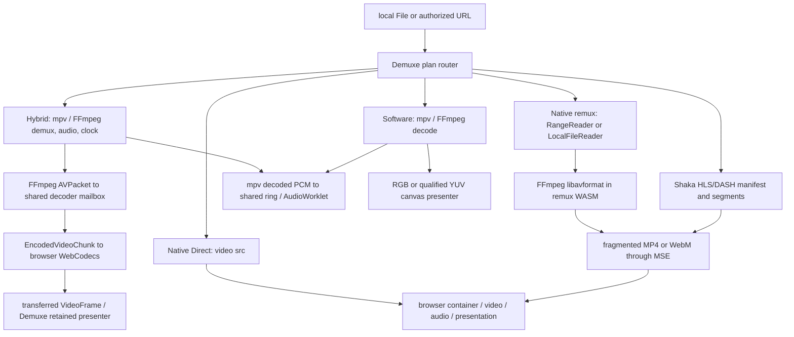

# MediaBunny in Demuxe: bounded architectural and packet-path investigation

**Date:** 2026-09-25. **Demuxe checkout:** `main` at `f2e35538caf98e9e6e2efbbe1766e9b0fae1c8ea`, with pre-existing unrelated dirty files preserved. **Scope:** source audit of the current checkout and MediaBunny 1.60.0, an isolated browser packet/decode PoC, a narrow synchronized H.264/AAC comparison, and interpretation of Demuxe's existing matched playback profiles. Production code and routing were not changed. The real-time PoC passes a bounded steady-playback gate, but lacks seek, output-fidelity, and multi-format qualification; its CPU result does **not** isolate demux cost.

## 1. Current Demuxe architecture

`src/unified-player.ts` chooses a finite plan from `src/internal/playback-plans.ts`. The plan owns *different* demux, decoder, audio, and display stacks:



This is **not** one universal `input → FFmpeg → WebCodecs` path. Native Direct bypasses Demuxe demux, packet extraction, WASM and WebCodecs APIs. Native remux uses FFmpeg's demux/mux but gives the *resulting fragments* to MSE, not `EncodedVideoChunk`. Shaka owns adaptive manifest, ABR, segment requests, MSE and browser decode. Hybrid is the explicit FFmpeg-packet-to-WebCodecs route. Software retains FFmpeg video decode.

| Function | Current owner and concrete boundary |
| --- | --- |
| Probe / metadata | Browser media element for Direct; `web/cheap-mp4-probe.js` and `web/source-probe.js`/`web/native-remux-worker.js` for inspected local/remote candidates; FFmpeg `avformat` for remux and mpv plans. `native/remux/remux.c` exposes track/config/duration records to JS. |
| Demux / packet extraction | Browser internally for Direct/MSE; Shaka for adaptive segments; FFmpeg `av_read_frame` for remux; mpv demux packets and `AVPacket` conversion in `native/vd_browser.c` for Hybrid. |
| Packet serialization | Remux calls `avformat_write_header`/packet writing into MP4/WebM fragments and transfers JS `ArrayBuffer`s to MSE. Hybrid writes timing/key/size fields and bytes to an 8 MiB shared decoder mailbox. |
| JS ↔ WASM / copies | Remote `RangeReader` uses 64 KiB blocks and 2 MiB cache, puts source bytes in a shared AVIO mailbox, and FFmpeg reads them. Hybrid `native/vd_browser.c` does a `memcpy` from `AVPacket` to decoder mailbox; `web/retained-decoder-worker.js` constructs a `Uint8Array` **view** of shared WASM memory and normally passes that directly to `EncodedVideoChunk`. The browser chunk constructor owns/copies the compressed data. A JS `.slice()` is a fallback, not the normal retained path. Remux emits owned fragment buffers; gathering fragmented outputs can copy, measured by `gatherCopiedBytes`. |
| WebCodecs config / submit | `web/video-codec-config.js` maps FFmpeg codec headers, including parameter sets, into WebCodecs configuration. `web/retained-decoder-worker.js` calls `isConfigSupported`, handles VP9 packet-derived config and HEVC seek restrictions, constructs chunks, queues at bounded depth, and calls the browser decoder. WebCodecs is video-only in the current Hybrid plan; mpv owns selected audio. |
| Audio / subtitles / fonts | Native Direct/MSE normally use browser audio and text. Hybrid/Software decode audio in mpv, move PCM to a shared ring, and play through `web/audio-worklet.js`. Embedded ASS/SSA, SRT, PGS, VobSub, font attachments and composition are mpv/libass duties. Narrow Native ASS and mpv subtitle services exist under plan admission rules. |
| Seek / presentation | Native seeks via media element and verifies actual presented frames. Remux may seek/rebuild fragments with FFmpeg; `RangeReader` validates 206 and source identity. Hybrid mpv seeks and selects PTS; retained frames transfer to `web/video-presenter.js` / `web/retained-video.js`, with mpv timing and bounded queues. Software draws decoded pixels through its presenter. |

Sources: [`src/unified-player.ts`](../../src/unified-player.ts), [`src/internal/playback-plans.ts`](../../src/internal/playback-plans.ts), [`src/internal/native-player.ts`](../../src/internal/native-player.ts), [`src/internal/shaka-backend.ts`](../../src/internal/shaka-backend.ts), [`web/range-reader.js`](../../web/range-reader.js), [`web/native-remux-worker.js`](../../web/native-remux-worker.js), [`native/remux/remux.c`](../../native/remux/remux.c), [`native/vd_browser.c`](../../native/vd_browser.c), [`web/retained-decoder-worker.js`](../../web/retained-decoder-worker.js), [`web/retained-engine-worker.js`](../../web/retained-engine-worker.js).

## 2. MediaBunny architecture and execution classes

The pinned 1.60.0 npm tarball was inspected in `/tmp/demuxe-mediabunny-source/package`; the exact bundled experiment artifact is in `benchmark/vendor/` with SHA-256 below. Its core parsers for MP4/MOV, Matroska/WebM, MPEG-TS, HLS, Ogg, WAV, FLAC, MP3 and ADTS are **TypeScript**. `Input`, `UrlSource`/`BlobSource`, `EncodedPacketSink`, track decoder configs, key-packet lookup and packet iteration are core APIs. `VideoSampleSink`/`AudioSampleSink` select **browser WebCodecs** when the browser admits a codec, and use a registered custom coder when available. Core MediaBunny does not hide a universal FFmpeg WASM demuxer. [Upstream overview](https://github.com/Vanilagy/mediabunny), [supported format registry](https://mediabunny.dev/guide/supported-formats-and-codecs).

`EncodedPacket.data` is a `Uint8Array`; `toEncodedVideoChunk()`/`toEncodedAudioChunk()` passes that data to the browser chunk constructor. `reader.ts` `readBytes()` returns `subarray()` views of a source slice. MP4 sample and Matroska block paths commonly carry such views into `EncodedPacket`, but container transforms, lacing, encryption, codec bitstream normalization, MPEG-TS PES assembly, and cache window boundaries can allocate/repack. `UrlSource` uses a read orchestrator, HTTP ranges, parallelism and cache, with sequential fallback if the server has no range support. View-backed packets are **not** zero-copy all the way into WebCodecs: chunk construction copies to browser-owned encoded storage under the current API.

| MediaBunny operation | Execution |
| --- | --- |
| Container parsing, metadata, indexing, keyframe lookup, packet enumeration, URL/Blob source buffering | TypeScript/JS. |
| H.264/HEVC/VP9/AV1/AAC/Opus/FLAC/PCM decode where supported | Browser WebCodecs; browser and OS codec behavior varies. PCM may also use MediaBunny JS handling. |
| ProRes with `@mediabunny/prores` | TurboRes Zig/WASM custom decoder, separately registered; optional shared-memory threading. [Extension](https://github.com/Vanilagy/mediabunny/blob/main/packages/prores/README.md), [TurboRes](https://github.com/Vanilagy/turbores). |
| AC-3/E-AC-3 with `@mediabunny/ac3` | Specialized FFmpeg `libavcodec` WASM decoder/encoder, not pure TypeScript and not the browser's native decoder. [Extension](https://github.com/Vanilagy/mediabunny/blob/main/packages/ac3/README.md). |
| DTS with `@mediabunny/dts` | Specialized FFmpeg `libavcodec` WASM decoder/encoder, separately registered. [Extension](https://github.com/Vanilagy/mediabunny/blob/main/packages/dts/README.md). |

The core advertises zero runtime dependencies and tree shaking. This PoC uses its 669 KiB minified **all-format** bundle, plus optional 252 KiB ProRes, 1.1 MiB AC-3 and 1.5 MiB DTS bundles; these are file sizes, not gzip or production tree-shaken bundle estimates. The optional decoders can add WASM and JS residency. Package and bundle licensing is MPL-2.0; any integration needs Demuxe's source/artifact/license audit, rather than treating the extension binaries as ordinary TypeScript.

## 3. Component overlap

| Demuxe component | Current implementation | MediaBunny alternative | Replaceable now? | Expected benefit class |
| --- | --- | --- | --- | --- |
| MP4/MOV and MKV/WebM probing / metadata | Browser, cheap MP4 probe or FFmpeg remux probe according to route | TS `Input` tracks/config/metadata | **Partial**: needs parity for selection, identity, timestamps, rotation and fallback | A; potential B/E if probe WASM load avoided |
| MP4/MOV/MKV/WebM demux for Hybrid | mpv/FFmpeg | TS `EncodedPacketSink` | **Partial**: video viable on screened files; no synchronized production audio/subtitle owner | A/C candidate |
| MPEG-TS/HLS/Ogg/WAV/FLAC/MP3/ADTS | FFmpeg, browser or Shaka according to plan | TS parsers/source | **Selective**; Shaka still owns adaptive policy/ABR/MSE | A/D candidate |
| HTTP range | Demuxe authenticated, identity-validated bounded reader; Shaka networking for manifests | `UrlSource` | **Only after** auth refresh, source identity, deadline and budget parity | D uncertain |
| WebCodecs config/chunk | FFmpeg headers + Demuxe mapping + shared mailbox | track config + `EncodedPacket.toEncoded*Chunk()` | **For admitted codecs**; browser chunk and decode still same | A; one FFmpeg→mailbox copy potentially saved in Hybrid |
| MSE fragment remux | FFmpeg `avformat` + bounded MSE owner | MediaBunny muxer could make fragments | **No drop-in replacement**; requires a new MSE segment producer and timestamp contract | A/B/D speculative |
| Direct video / Shaka | Browser media element / Shaka | None needed for current qualified routes | **No**; replacing them would add work | None |
| Audio decode/clock | Browser audio for Native; mpv PCM + AudioWorklet for Hybrid | WebCodecs or optional AC-3/DTS decoder | **Partial**; channel layout, sync, rate, seek, worklet transport unqualified | A/C candidate |
| ASS/SSA/SRT/PGS/VobSub | mpv/libass and subtitle services | Core recognizes only WebVTT as a subtitle codec | **No** for these routes | Keep mpv/libass |
| MKV fonts / attachments | FFmpeg/mpv attachment path | `getMetadataTags().raw` `AttachedFile` | **Extraction yes**, font registration/styling no | A only |
| Chapters, obscure codecs, damaged files | FFmpeg/mpv/bounded compatibility fallback | Some metadata/parser coverage, no demonstrated parity | **No** | Keep FFmpeg fallback |

On `fixtures/m0.mkv`, MediaBunny exposed a 757,076-byte `DejaVuSans.ttf` attachment via raw metadata, while `getTracks()` returned only video/audio and no ASS subtitle track. This is a more precise boundary than saying it cannot read MKV attachments. MediaBunny's core `SUBTITLE_CODECS` list currently contains only `webvtt`. No complete ASS styling, PGS bitmap or chapter behavior was demonstrated.

## 4. Current CPU/profile findings and attribution limit

The most relevant existing *matched* Demuxe profile is [`results/hybrid-presentation-matrix/REPORT.md`](../../results/hybrid-presentation-matrix/REPORT.md): H.264 720p30 median Native 42.60%, Hybrid visible 69.44%, Hybrid no-draw 50.84%; 1080p60 Native 54.77%, Hybrid visible 84.96%, Hybrid no-draw 61.20%, all as percent of one core in their own paired campaigns. The presentation-associated differences were 19.04 and 24.46 core points; the residual no-draw versus Native differences were 5.09 and 6.15 points. **The residual is not demux CPU**: it includes mpv audio/clock, packet handling, retained-frame transfer, scheduling, and the fact that no-draw removes display work Native still does. The saved Chrome trace identified 362 1920×1080 source-size RGB shared-image allocations and raster passes in about six seconds of visible Hybrid, absent in Native/no-draw. MediaBunny feeding the same retained presenter would still trigger that work.

[`results/hybrid-cpu-attribution/REPORT.md`](../../results/hybrid-cpu-attribution/REPORT.md) additionally found that about 600-frame, 20-second Hybrid runs had zero explicit WebCodecs pixel copies and a small PCM ring copy timer (about 5.8–6.0 ms for 7.7 MB read plus 7.7 MB written). The native FFmpeg demux CPU, codec decode CPU, and packet bridge CPU were **not** separable from renderer process totals. The `retained-decoder-worker` already records `packetBytes`, `ownedPacketBytes`, and `sharedPacketInputs`; it normally avoids the JS `.slice()` for compressed packets. MediaBunny cannot take credit for eliminating that already-absent JS copy. The FFmpeg AVPacket→mailbox `memcpy` remains real.

**No defensible 1–3% demux share or alternate percentage was measured.** A whole-player CPU decomposition into demux, browser decoder, audio, presentation and other mpv cost is incomplete. The finite PoC below times browser packet/config/decode operations. The separate narrow real-time PoC compares full Chrome process CPU on one H.264/AAC fixture, but also changes audio decoder, scheduling, and frame handoff. Its observed difference is an upper hypothesis for the combined alternate architecture, not a measured demux/bridge subtotal.

## 5. Buffer lifetime and copy boundaries

```text
Native Direct:
source → browser network/cache → browser demux → browser decoder → browser video compositor
          browser-owned internals; Demuxe sees no compressed packet or pixel copy

Native remux/MSE:
network/File → JS range/Blob buffer → shared AVIO mailbox [copy]
  → FFmpeg AVIO/demux/AVPacket [WASM allocations]
  → FFmpeg fragmented MP4/WebM mux [packet/write work]
  → JS fragment ArrayBuffer [WASM→JS output copy/ownership]
  → MSE/browser demux → browser decoder/presentation

Hybrid retained:
network/File → JS AVIO mailbox [copy for remote]
  → mpv/FFmpeg AVPacket in WASM [allocations]
  → shared decoder mailbox [AVPacket memcpy; WASM→JS shared-memory boundary]
  → Uint8Array *view* [no normal JS copy]
  → EncodedVideoChunk [browser-owned compressed copy]
  → WebCodecs VideoFrame [browser-owned]
  → transferable frame to presenter [ownership transfer, no pixel copyTo]
  → Canvas2D drawImage [measured browser/GPU intermediate and raster]

MediaBunny PoC:
network/Blob → JS source cache [fetch/body allocation]
  → parser FileSlice → packet Uint8Array view where eligible [no WASM boundary]
  → optional codec repack/decrypt/PES assembly [conditional copy]
  → EncodedVideoChunk/EncodedAudioChunk [browser-owned compressed copy]
  → WebCodecs VideoFrame/AudioData [browser-owned]
  → same Demuxe retained video presenter [same Canvas2D cost]
```

For Hybrid, the unavoidable browser chunk copy is roughly one compressed packet payload per submit; the extra **avoidable** steady-state copy is the FFmpeg packet→mailbox write, also roughly one payload. For a 3.84 Mb/s 1080p H.264 source, one such write is about 0.48 MB/s nominal; for the 10.7 Mb/s HEVC fixture, about 1.34 MB/s. Those are bitrate calculations, **not measured bandwidth or CPU savings**. Metadata/codec config may copy separately; special keyframes may prepend bytes. The 1080p60 Canvas2D intermediate is 8.29 MB/frame nominal, about 498 MB/s at 60 fps before further raster work. That is a separate browser presentation mechanism that MediaBunny does not remove.

## 6. PoC implementation and methodology

The finite format-screen code is [`benchmark/poc.js`](benchmark/poc.js), [`benchmark/page.html`](benchmark/page.html), [`benchmark/run.mjs`](benchmark/run.mjs), and [`benchmark/prepare.py`](benchmark/prepare.py). It serves files from a local range-capable, cross-origin-isolated HTTP server. `UrlSource` parses tracks/configs; `EncodedPacketSink` retrieves video/audio and key packets; a bounded finite batch goes to `VideoDecoder`/`AudioDecoder`; decoded `VideoFrame`s use Demuxe's unchanged [`web/video-presenter.js`](../../web/video-presenter.js). Audio outputs are closed after decode, not played. Optional extension runs use `VideoSampleSink`/`AudioSampleSink`. The script records request ranges, bytes, startup stages, 90 video packet decode counts, 40 audio packet decode counts, and four cached key/packet lookups. Input files are synthetic or existing Demuxe fixtures. `notes/fixture-manifest.json` retains FFmpeg commands and hashes for generated media; `notes/*screen*.json` retain raw browser outcomes; [`result.json`](result.json) indexes them.

The **finite format screen** did not implement an A/V master clock, real-time throttling, Demuxe PCM worklet publication, end-of-stream policy, subtitle composition, frame drop tracking, pause/rate/track-switch semantics, seek-to-present, allocation/GC attribution, or repeated matched CPU windows. Its `inputOpenMs` is only synchronous object construction; actual source opening is included in `metadataReadyMs`. Its `firstPresentedMs` is the first *decoded burst frame drawn*, not user-visible player startup latency; `lookupMs` is indexed packet access, not playable seek latency. The local server reports requested response bytes and can count overlap, but this short-file screen is not a comparison with Demuxe's validated remote transport.

## 7. Browser and format results

Format screen: Chrome 153.0.8010.53, Firefox 146.0.1, Playwright WebKit 26.0 on this Mac. `V/A` means 90 video chunks and 40 audio chunks decoded; `V` means video decoded while browser audio config was rejected. These are synthetic 4-second, 640×360 files except the separate low-complexity and DTS cases. `—` means the browser rejected that WebCodecs config. All listed containers parsed and returned metadata/packets. Failures are decoder or audio-output boundaries, not proof of a demux failure.

| Fixture | Chrome | Firefox | WebKit | Exact limit |
| --- | --- | --- | --- | --- |
| MP4 H.264/AAC | V/A | V/A | V/A | None in finite probe |
| MKV H.264/AAC | V/A | V/A | V/A | None in finite probe |
| MKV HEVC/AAC | V/A | audio only | V/A | Firefox `VideoDecoder.isConfigSupported=false` in tested profile |
| MKV AV1/Opus | V/A | V/A | audio only | WebKit AV1 video config rejected |
| WebM VP9/Opus | V/A | V/A | V/A | None in finite probe |
| MOV H.264/PCM16 | V/A | V/A | V/A | None in finite probe |
| MOV ProRes/PCM16 | PCM only | PCM only | PCM only | Browser WebCodecs ProRes rejected; TurboRes extension separately decoded 90 video samples |
| MKV H.264/FLAC | V/A | V/A | V; FLAC error | WebKit reported config support but audio decode threw in this one run; no audio qualification |
| MKV H.264/AC-3 | V; no browser AC-3 | V; no browser AC-3 | V; no browser AC-3 | AC-3 extension separately decoded 60 samples |
| MKV HEVC/E-AC-3 | V; no browser E-AC-3 | neither browser codec | V; no browser E-AC-3 | E-AC-3 extension separately decoded 60 samples |
| MKV H.264/DTS | V; no browser DTS | V; no browser DTS | V; no browser DTS | Existing 1080p Demuxe DTS fixture; DTS extension separately decoded 60 samples |
| MPEG-TS H.264/AAC | V/A | V/A | V/A | Indexed seeks are more scan-sensitive than MP4/MKV |

For low-complexity samples, 480p H.264 (90/90), 720p30 H.264 (90/90), 1080p60 H.264 (90/90), and a short 4K H.264 (48/48 available frames) decoded in all three browsers. The generated AAC-only MP4 decoded 40 audio packets in all three; it has no video frame by design. These counts establish a workable packet/config path, not real-time display or measured CPU percentage. The 4K fixture is only two seconds, so no steady-state conclusion follows.

In the synthetic format screen, metadata-ready time ranged from roughly 2–14 ms in Chrome, 3–14 ms in Firefox, and 3–13 ms in WebKit for most files; the first draw generally occurred within tens of milliseconds in this warm local fixture setup. Some first draws were 80–90 ms. These are one-pass local timings with warm browser/OS caches, no matched Demuxe arm and no player readiness gate. They support technical feasibility only. The 4-second files often transferred the entire file (one to three HTTP requests); no range/network saving is established. The four indexed seek lookups were mostly sub-millisecond after parsing/caching, but neither a fresh remote range seek nor first post-seek presented frame was measured.

## 8. Narrow real-time H.264/AAC comparison

[`benchmark/realtime.js`](benchmark/realtime.js) is an experiment-only A/V loop. It uses MediaBunny packet sinks, browser WebCodecs for **both** H.264 video and AAC audio, Demuxe's existing `WebCodecsPresenter`, and the unchanged `web/audio-worklet.js` fed by a bounded 8,192-frame shared PCM ring. An optional [`presenter-worker.js`](benchmark/presenter-worker.js) transfers selected `VideoFrame`s to an OffscreenCanvas worker to approximate Hybrid's worker presentation ownership. Audio consumption is its master clock. [`benchmark/run-realtime.mjs`](benchmark/run-realtime.mjs) serves the **same** 30.04-second, 1280×720/30 H.264/AAC MKV to forced Demuxe Hybrid and both MediaBunny variants in fresh contexts of one Chrome process. It waits four seconds before each ten-second CPU window. Chrome 153.0.8010.53 process CPU is summed by CDP, in percent of one core. The accepted runs used Demuxe's 150-second macOS Chrome startup-completion trace gate; all windows had stable process IDs, advancing video, about 300 presented/decoded frames, and no reported player errors. The MediaBunny lanes consumed about 485,000 audio frames/window, reported zero worklet underruns, and stayed within 8–15 ms of their own audio clock. A/V content correctness, physical display cadence, and Demuxe's audio fidelity were **not** independently checked.

| Gated order / retained raw file | Hybrid | MediaBunny main canvas | MediaBunny worker canvas | Interpretation |
| --- | ---: | ---: | ---: | --- |
| A–B–B–A, [`realtime-gated-abba-20260925.json`](notes/realtime-gated-abba-20260925.json) | 31.17%, 29.17% | 22.73%, 24.03% | — | Main-thread PoC lower in this bracket; cannot assign to demux. |
| A–W–B–W–A, [`realtime-gated-presentation-20260925.json`](notes/realtime-gated-presentation-20260925.json) | 27.40%, 29.58% | 23.96% | 24.92%, **31.03%** | Worker-presented PoC spans both sides of Hybrid; no stable worker-path saving. |

The first gated bracket's median Hybrid–main-PoC difference is about **6.8 core points**, but the presenter/thread ablation removes confidence that this is a demux/packet saving. The worker PoC's two values differ by 6.1 points without a route change; GPU process CPU moves materially. Earlier ungated A/B runs ranged much higher, and one later Hybrid window fell from 68.2% to 51.7% with correct frame progression; those are retained as exploratory [`realtime-abba-20260925.json`](notes/realtime-abba-20260925.json) and [`realtime-abba-transmitted-20260925.json`](notes/realtime-abba-transmitted-20260925.json), excluded from the CPU inference. The repeated gated Hybrid windows also vary. Renderer CPU was generally lower for MediaBunny, but its audio decode, clock, main-thread work and frame handoff differ from Hybrid. No stage timer converts that difference into a demux percentage.

The actual server-body counter, added after the first exploratory run, saw **11,351,386 bytes / 44 requests** for Hybrid in every gated arm (a contiguous 256 KiB range walk). MediaBunny fetched **12.02–12.68 MB / 5–6 requests**, including an open-ended initial range and overlapping later ranges. These are server-emitted body bytes on one local VOD source, not browser cache or wire-level byte counts; source defaults are not tuned. They show **no network saving in this test** and a modest overfetch cost. The first exploratory log recorded planned response sizes even after cancellation and must not be used for transferred-byte conclusions.

Peak summed browser-process RSS crossed roughly 1.0–1.3 GiB and shifted with context/process reuse; no reliable A/B resident-memory reduction can be claimed. JavaScript allocations, GC, WASM demux CPU, first-frame startup under the standardized gate, and seek-to-present remain unmeasured. The PoC omits seek, pause/rate changes, alternate tracks, subtitles, EOF qualification, and output or stereo-tone oracles. The worker ablation is closer to the current Hybrid presenter architecture but still changes the audio decoder, master clock, packet producer thread, and backpressure. **The gated CPU observation is a reason to keep the research path, not a production performance result.**

## 9. Codec extensions, separate from demux

The pinned extension bundles registered successfully in all three browsers. On 640×360 ProRes Proxy/PCM MOV, TurboRes decoded 90 video samples (first-sample roughly 31–38 ms; finite loop 47 ms Chrome, 163 ms Firefox, 79 ms WebKit in a single run). On the synthetic AC-3 and E-AC-3 files, their FFmpeg-derived extension decoded 60 audio samples; the DTS extension did the same on Demuxe's existing 1080p DTS fixture. This is **component throughput only**; output samples were closed, not synchronized or checked against an oracle. The first-sample time includes lazy WASM initialization and differs from warm decode time. It must not be compared numerically with Demuxe's old Software CPU rows.

The existing Demuxe real-packet ProRes WebGPU experiment reached correctness but was performance-negative and deferred: [`ATTRIBUTION.md`](../prores-real-packet-webgpu/ATTRIBUTION.md). It used FFmpeg entropy extraction and GPU reconstruction, not TurboRes, and its CPU campaign is not matched to this extension run. ProRes/TurboRes has the clearest independent optimization hypothesis because it changes the **video decoder**, while MediaBunny's demuxer does not. The AC-3/DTS extensions are smaller FFmpeg decoders that might reduce mpv stack residency or enable selective routing, but no whole-player CPU, memory, surround fidelity or A/V sync comparison exists. Extension license/binary closure also needs inspection before any production candidate.

## 10. Pros, risks, and recommendation

| Class | Supported advantage / limit |
| --- | --- |
| A. Structural | Direct packet/config access in JS and easy component experiments; potential independent video/audio routing. A second demuxer also expands timestamp, seek, malformed-file, subtitle, track identity, transport and test matrices. Direct/MSE/Shaka paths remain simpler when already qualified. |
| B. Startup | Could skip remux/mpv WASM initialization for an admitted Hybrid-like case; not measured against a matched current route. Direct already skips it. |
| C. Steady state | Saves FFmpeg packet→shared-mailbox copy and mpv demux/clock work only if MediaBunny fully replaces that owner. Browser chunk copy, WebCodecs decode and Canvas presentation remain. A gated main-thread PoC was lower in one bracket, but the worker-presenter ablation overlapped Hybrid; demux-specific savings are unproven. |
| D. Network/seek | MediaBunny has range/cache/keyframe APIs; the matched local H.264/AAC run fetched about 0.7–1.3 MB more server body than Demuxe's 11.35 MB, with fewer requests. Demuxe has validated identity/auth/deadline contracts. Seek-to-present was not compared. |
| E. Bundle/memory | Core bundle can be smaller than FFmpeg assets, but optional codec decoders add WASM. A route that still needs mpv for ASS/PGS/audio retains both stacks. Peak process RSS and GC do not establish a saving. |

**Classification:** **Category 4, strategic research infrastructure (candidate)** and possibly **Category 1, structural improvement** for narrow packet experiments. Categories **2 and 3 are unproven**. The gated main-thread lane is an encouraging whole-alternate-path signal on one H.264/AAC fixture, but its worker-presenter control and incomplete correctness contract do not establish a meaningful *demux-attributable* playback optimization. The measured Hybrid gap still points substantially to browser Canvas presentation; substituting its demuxer alone would leave that path. A production integration experiment is **not justified by current qualified benefit**. The smallest next *test-only qualification* is to extend the existing H.264/AAC worker PoC with full seek/pause/rate/output-tone and EOF checks, then run at least three counterbalanced, startup-gated matched CPU windows on 480p, 720p and 1080p with memory/GC/network/packet-copy counters. Only if a worker-presented gain repeats should an opt-in local MKV H.264/AAC plan be considered, preserving mpv fallback and all existing Native Direct admissions.

## Reproduction and retained evidence

```sh
python3 experiments/mediabunny-investigation/benchmark/prepare.py
node experiments/mediabunny-investigation/benchmark/run.mjs --browsers=chromium,firefox,webkit /tmp/demuxe-mediabunny-fixtures/h264-aac.mp4
node experiments/mediabunny-investigation/benchmark/run-realtime.mjs --startup-gate --arms=hybrid,mediabunny-worker,mediabunny,mediabunny-worker,hybrid --seconds=10
node experiments/mediabunny-investigation/benchmark/aggregate.mjs
```

The runner accepts `--extensions` and `--out=...`; it writes `notes/latest-run.json` by default so an exploratory rerun cannot silently overwrite the aggregate `result.json`. It uses the installed `/Applications/Google Chrome.app` for Chromium, and Playwright's Firefox/WebKit browsers. Host setup, browser versions, fixture hashes and raw failures are retained in the JSON files. Artifact SHA-256: core `ea3f1a537e64aa99e1e5af7d066977d4fac90bc6d71617200b4ab8147fb17f5a`; ProRes `6cabe5a88fa9fc6c06212f357cc1bf56e3b42d7a327c06f789eab22d02cc5903`; AC-3 `652ccb4a8acc9f257c95fe57ee21e225ecc74b9566`; DTS `b10fb2f1ddfa27f70501658f7f225532b807d539c1ee57ee21e225ecc74b9566` (all `@mediabunny/*` and core at 1.60.0). The bundled extension `.mjs` files are experimental artifacts only; they are not imported by production code.

## Concise answers

1. **Steady-state playback?** Main-thread MediaBunny used less Chrome CPU in one gated H.264/AAC bracket, but worker-presented runs overlapped Hybrid. A material, demux-attributable improvement is **not established**.
2. **Startup/seek/memory/network?** No qualified startup/seek/memory gain. The matched local URL fetched **more** server body with MediaBunny defaults. Direct already avoids FFmpeg.
3. **JS/WASM copies?** It removes Hybrid's AVPacket→shared-mailbox write and the WASM boundary if it replaces mpv demux. Current Hybrid already avoids the normal JS `.slice()`; the `Encoded*Chunk` browser copy remains.
4. **Replaceable components?** Selected common-container probe, metadata, packet extraction, config and some audio/attachment extraction; no automatic MSE or adaptive route replacement.
5. **Still mpv/FFmpeg?** Software fallback, unsupported browser codecs, ASS/SSA/SRT/PGS/VobSub composition, advanced track/seek behavior, unusual/damaged files, filters, and many qualified audio routes unless separately replaced.
6. **Extensions more interesting?** TurboRes ProRes is the stronger independent performance hypothesis; AC-3/DTS may help selective ownership but currently remain FFmpeg-derived WASM.
7. **Simplify overall?** A narrow research packet API would simplify experiments. Adding a production second demux stack today would complicate routing and qualification.
8. **Production integration now?** No. The synchronized one-format PoC needs seek, tone/output fidelity, repeated worker-path CPU and transport qualification.
9. **If evidence changes, first slice?** Opt-in local MKV H.264/AAC with Demuxe's existing presenter/worklet and mpv fallback, only after full correctness and matched CPU/network gates.
10. **Architectural lesson regardless?** Keep component-level packet/config ownership explicit, preserve direct/MSE paths, and prioritize the measured presentation cost over speculative demux CPU work.
