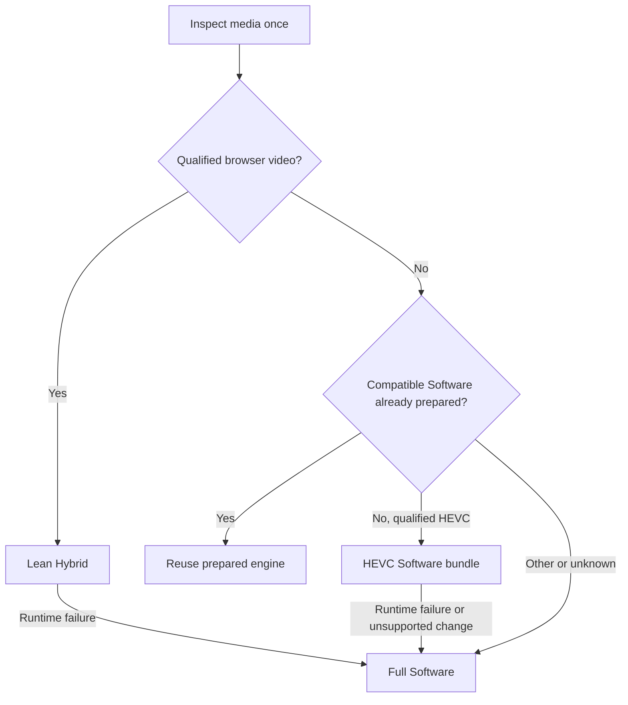

<!-- SPDX-License-Identifier: CC-BY-4.0 -->
# Granular loading: full feasibility study

Follow-up to the initial failed registry-only screen. Canonical run: `evidence/20260921T171411Z-full-study-02`; its `PLAN.md` and `SOFTWARE-HEVC-PLAN.md` were written before their experiments. All prototypes are isolated. No experimental engine or routing change was installed into production.

## Decision

Pursue a lean Hybrid and a finite HEVC Software bundle as the first integration candidates. Both meet the size and startup criteria on the tested user-file workload. Keep full Software as an explicit fallback, preserve decoder ordering, use inspected codec information, and give each binary an immutable cache identity.

True lazy codec modules are technically feasible: an actual H.264/parser FFmpeg side module decoded the full fixture correctly in Chrome and Firefox, with pthreads, after loading on demand. The test also demonstrates that modularity can increase total bytes. It is a validated component prototype, not an integrated mpv decoder backend or a measured whole-player module speedup. Treat that integration as a larger, separately qualified proposal.

A common-codec Software profile is useful but less compelling for this user's HEVC file: 17.65% compressed reduction, below the declared 20% size threshold. The HEVC-specific bundle provides a larger reduction. Whole-engine bundles duplicate core/audio/subtitle code if several profiles are eventually loaded; they are a practical intermediate step, not perfect codec granularity.

## Whole-player measurements

All startup tests use `/Volumes/seed2/Projects/startup-repro/software_test_slow.mkv`, without copying the MKV into the repository. Chrome selects Hybrid/WebCodecs; Firefox selects Software for HEVC. These results compare against the already optimized frozen runtime from screen-01, including its browser preflight. They are not a replay of the older reported 7–10-second local delay.

| Build | Raw MB | Gzip MB | Gzip saving vs matched full |
|---|---:|---:|---:|
| baseline | 22.064 | 8.128 | 0.00% |
| lean | 14.874 | 5.830 | 28.28% |
| software-baseline | 21.427 | 7.945 | 0.00% |
| software-common-v2 | 17.433 | 6.543 | 17.65% |
| software-hevc | 15.057 | 5.879 | 26.01% |

Decimal MB; size screen uses gzip level 6. All raw sizes, hashes and exact byte counts are in `sizes.json`.
Offline Brotli quality-6 measurements provide another deployment reference: Hybrid **7.19 → 5.30 MB** and HEVC Software **7.01 → 5.28 MB**. Decompression was verified byte-for-byte. Browser timings used gzip; no Brotli latency benefit is claimed. Node and Python gzip sizes differ slightly; `compression.json` records compressor versions and both transfer-size baselines.

| Browser / candidate | Condition | Pairs | Full baseline | Candidate | Median reduction |
|---|---|---:|---:|---:|---:|
| chrome / lean Hybrid | local | 5 | 0.846 s | 0.876 s | -3.6% |
| chrome / lean Hybrid | 10mbps | 5 | 8.566 s | 6.738 s | 21.3% |
| firefox / common Software | local | 3 | 1.510 s | 1.377 s | 8.8% |
| firefox / common Software | 10mbps | 3 | 8.988 s | 7.717 s | 14.1% |
| firefox / HEVC Software | local | 3 | 1.458 s | 1.257 s | 13.8% |
| firefox / HEVC Software | 10mbps | 3 | 8.964 s | 7.115 s | 20.6% |

All **44 paired-matrix timing trials** passed route/progress/teardown checks. Negative reductions indicate slower medians. Chrome network paired savings are 1.78–1.86 s across five pairs; HEVC Software network savings are 1.71–1.89 s across three pairs. These are observed ranges, not population guarantees.

Local Chrome results show no benefit from the smaller Hybrid. Network-constrained results show a repeatable transfer benefit. Firefox's HEVC-specific profile also shows a modest local improvement in this small sample. Coarse CPU and aggregate RSS deltas are retained in JSON; their variability does not justify a memory or energy claim. All engine profiles still start with the same 128 MiB Wasm linear-memory setting.

The admission-only Hybrid control is almost identical in size to the baseline and passes the H.264 output/lifecycle check. This separates the browser-admission source change from decoder removal. The first full baseline relink from screen-01 was byte-identical to shipping Hybrid; the Software comparisons use a separately matched full relink and pruned relink with otherwise identical source/options.

## What changed in the isolated builds

**Hybrid.** mpv previously reached `vd_browser.create()` only while looping through registered FFmpeg video decoders. The prototype attempts browser admission independently before software candidates. Removing 268 registered video implementations then works. The original registry-only failure remains archived; it is not relabeled as passing. The lean registry retains some wrapper/metadata entries, including FFmpeg's AV1 wrapper, so this is not a claim that every video-related function disappeared.

**Common Software.** Keep H.264, HEVC, VP8, VP9 and AV1/dav1d plus the original audio/subtitle/other entries. The first version accidentally changed list ordering, putting FFmpeg's AV1 entry before dav1d; AV1 failed. A new v2 preserves the upstream order and passes the tested codecs. This is a concrete compatibility requirement, not just a size optimization.

**HEVC Software.** Keep HEVC plus the original nonvideo entries; remove the remaining AV1 wrapper. H.264 and MPEG-4 adversarial inputs are inspected and routed to full Software instead. The lab selector demonstrates that decision before engine startup. A separate injected runtime failure also demonstrates explicit full-engine reopen/seek/resume from the HEVC profile. It is not integrated into the production router and performs its own inspection, whose cost is recorded separately. An integration must share the existing probe result and handle runtime failures, multiple tracks and source changes.

## Correctness, failures and exclusions

Accepted Chrome Hybrid profiles: H.264, HEVC user file, VP9 and AV1. Firefox also executes the lean H.264 Hybrid path successfully. Common Software v2 is tested in Firefox for H.264, HEVC, VP8, VP9 and AV1. HEVC-only Software is tested on the user HEVC file, with inspected H.264 and MPEG-4 full-engine fallback controls.

Tests include actual selected engine/decoder, advancing audio/video, synthetic 1 kHz audio, independent host-FFmpeg RGB output at fixed positions, backward/forward seeking, pause/resume, source replacement, runtime Hybrid-to-Software recovery, and teardown. Whole-player trials check remaining workers; later Firefox trials also capture owned process IDs and verify process exit, alongside Chrome's CDP process checks. The earliest Firefox functional runs predate that OS-level check and are identified by missing process fields in their raw records.

The full-frame RGB oracle uses MAE <=6; candidate/baseline comparisons use MAE <=2. Wrong-picture inverted references fail. Firefox's early device-pixel-ratio screenshots are normalized to CSS dimensions for comparison; later screenshots request CSS scale directly. Synthetic fixtures carry explicit BT.709 metadata.

Two known baseline limitations remain visible:

- Chrome VP8 is identical between baseline and candidate but fails the independent color oracle (MAE 8.62). Its browser configuration does not carry the container color metadata; that is a source-supported hypothesis for the mismatch, not a completed fix. No VP8 Hybrid fidelity qualification is claimed.
- ASS on/off and baseline-equivalence checks pass, but the synthetic overlay has a large black backing area in both builds. These checks establish nonregression, not complete ASS visual correctness. The user file has no active subtitle cue at the sampled position.

A failed initial Software AV1 trial is preserved beside its corrected v2. Missing local include paths and unavailable `libaom-av1` were harness/build setup failures; successful retries use the proper generated headers and installed SVT-AV1 encoder. They are not runtime product regressions. Failed module prototypes are described below.

## Preparation, caching and recovery costs

| Browser | Preparation | Preparation time | Selection to progress | Sum, excluding browser launch |
|---|---|---:|---:|---:|
| chrome | none | 0.00 s | 6.76 s | 6.76 s |
| chrome | selective | 5.82 s | 0.83 s | 6.65 s |
| chrome | all | 12.57 s | 0.84 s | 13.41 s |
| firefox | none | 0.00 s | 7.71 s | 7.71 s |
| firefox | selective | 7.18 s | 0.70 s | 7.88 s |
| firefox | all | 11.81 s | 0.69 s | 12.50 s |

These samples use lean Hybrid in Chrome and common Software v2 in Firefox. Preparing all brings little additional selection benefit for this file while taking longer up front. Immediate selection during preparation took **6.89 s with selective preparation versus 11.75 s with all** in Chrome at 10 Mbps.

With a warm HTTP cache after page reload, the 10 Mbps-model sample fell from **6.77 to 0.62 s in Chrome** and **7.59 to 1.17 s in Firefox**. That supports reusing cached compatible engines rather than always selecting the smallest cold bundle.

Forced Hybrid-to-full-Software recovery at 10 Mbps took **7.65 s with no preparation**, **7.65 s with selective preparation**, and **0.63 s with all preparation**. The HEVC-bundle runtime-failure probe separately fetched full Software, reopened the same file, restored position and resumed audio/video; open/seek/play took **8.42 s**. That recovery is implemented by the research orchestrator, not the production router.

**Slow-link failure control:** at 5 Mbps, all preparation hit the existing 15-second per-asset deadline; inspector/font were ready but Hybrid and Software were aborted. Playback still recovered through an on-demand engine fetch, taking another 11.16 s to progress: **26.17 s for preparation plus selection**. The failed requests consumed partial transfer before retry. Thus eager preparation can worsen first use on slow links.

A separate HTTP 503 for unused Software was reported as a failed preparation asset while Hybrid still played. The first fault harness incorrectly expected a rejected promise; the API instead returns per-asset statuses. That harness failure and its corrected passing test are both retained.

Preparation timings are charged separately from selection-to-progress. A quick selection after a long preparation phase is not a reduction in total first-use cost. `selective` prepares inspector plus the expected engine; `all` prepares every existing component, including an engine unused by this file/browser. The policy samples are exploratory, one per condition, not the paired primary benchmark.

Cache tests reload the page within the same browser context with cacheable responses, then reopen the same file. They are distinct from simply replacing a source in the current player. Recovery tests inject a Hybrid failure and measure actual Software startup. The unused-Software-asset failure test checks whether a failed asset status returned by `prepare(all)` still permits Hybrid playback.

## Actual runtime codec modules

The module probe uses a real FFmpeg H.264 decoder and parser, not a dummy arithmetic function. It parses and decodes 240 frames with two decoder threads configured; all active luma bytes match an independent host-FFmpeg FNV-1 checksum of **2494589137**. A matched static decoder is the reference implementation.

The production FFmpeg archives cannot be reused unchanged as side modules: the linker reports `R_WASM_MEMORY_ADDR_*` relocations requiring `-fPIC`. A separate minimal PIC FFmpeg build resolves that prerequisite.

A first MAIN_MODULE=2 host declared the side module at link time. Decoding worked, but the test correctly rejected it as a lazy-loading prototype because the codec was fetched eagerly. MAIN_MODULE=1 without that dependency achieved true lazy loading but kept too much system code. The final MAIN_MODULE=2 host explicitly retains 86 required external symbols and does not list the codec as a load-time dependency.

| Module layout | Wasm raw bytes | Wasm gzip bytes | Meaning |
|---|---:|---:|---|
| H.264 side module | 1,413,168 | 355,943 | Fetched only on explicit load in final prototype |
| Default lazy host, MAIN_MODULE=1 | 1,650,116 | 617,297 | Working but excessive retained system code |
| Explicit-symbol lazy host, MAIN_MODULE=2 | 100,052 | 52,669 | Final successful deferred-load host |
| Load-time dependency host | 100,066 | 52,836 | Rejected as lazy: codec fetched eagerly |
| Static H.264 decoder | 1,422,611 | 382,706 | Matched component reference |

Both Chrome and Firefox verified that the final host did not request the codec before the explicit load. Decode, `dlclose`, reload and a second exact decode passed. A deliberately corrupted Wasm module was rejected, with worker cleanup. Successful `dlclose` is not evidence that compiled-code memory was reclaimed.

The optimized host+codec costs **408,612 gzip bytes**, versus **382,706** for the matched static Wasm decoder: **6.8% more total Wasm bytes**. Before a codec is required, only the 52,669-byte host is needed. This demonstrates the actual tradeoff: lower initial bytes for unused capabilities, additional total bytes and linking work when those capabilities are used. JavaScript glue is additional and larger for the dynamic host; individual file sizes are recorded. No claim is made that this component's size or decode speed transfers directly to the complete player.

The probe uses an isolated 32 MiB heap. It does not prove integration with mpv's eight-thread engine, shared codec state, presentation, subtitles, audio, streaming, cancellation, arbitrary seeks or long-lived module retention. The PIC build uses FFmpeg 7.1.1 source, verified through its RELEASE file and captured source hashes. Its generated `ffversion.h` accidentally picked up the enclosing Demuxe Git revision; this metadata anomaly is preserved and is not used to identify the codec source. Static and dynamic probes use the same PIC objects. Those remaining player behaviors are integration qualification work, not an unresolved question about whether this toolchain can load a real decoder lazily.

## Integration proposal

This diagram is a proposal; Native routes remain governed by the existing player and are omitted for readability. Required implementation work:

1. Make browser decoder admission independent while preserving intended decoder preference semantics; the prototype's direct admission is a research simplification.
2. Generate finite bundle manifests with exact codec/dependency contracts, retain upstream registry order, and share one metadata inspection.
3. Use immutable profile/version asset URLs and compiled-module cache keys that include binary identity. The lab's same-URL/no-store substitutions must not become a production cache strategy.
4. Reuse an already prepared compatible full engine instead of downloading a smaller cold one. Keep startup preparation opt-in and expose its time/bytes separately from playback readiness.
5. Implement and qualify full-engine recovery for partial-bundle failures and track/source changes. Test missing/corrupt resources, cancellation and bounded teardown in the maintained suite.
6. Avoid waiting for every preparation task before accepting a selection; prioritize required assets, handle timeout/retry without repeated waste, and report per-asset status. Background fallback preparation after playback would require an API change: the current `prepare()` returns the existing task once a source is active. That policy was not benchmarked here.
7. Only then evaluate codec side modules inside the actual player. Define a versioned packet/frame/error/reset ABI, a shared-core strategy, thread-table synchronization and a retention policy. Keep the number of supported combinations finite.

The [architecture notes](tests/full/ARCHITECTURE.md) explain the shared-core versus per-module-facade choices, duplicate-code costs and cache/preparation requirements in more detail.

## Method, evidence and limits

Chrome 152.0.7977.83 and Firefox 146.0.1, headed on this macOS ARM64 machine. Browser launch is excluded. Primary trials use fresh browser processes/profiles and alternating order: five pairs per Chrome condition, three per Firefox condition. The HEVC-specific follow-up has a newly measured three-pair baseline per condition; it does not reuse the common-profile baseline timings. All raw samples and small-sample paired bootstrap intervals are retained.

The progress endpoint is the first observation of media time >0.2 seconds, so it includes that playback interval and polling delay. Open-return timing is also recorded. This is not physical photon/speaker latency. Processes are fresh but OS caches are not flushed; unrelated existing processes remain on the host. Builds and other browser tests were paused during timing matrices.

The 10 Mbps condition applies one aggregate paced budget to gzip Wasm responses plus 80 ms initial delay per response. JS, fonts and the local media file are not bandwidth-limited. Hybrid uses precompressed gzip; other assets are compressed by the server on request, so their timings include that server work. Size-screen gzip and served-byte counts can differ slightly with compressor versions; raw HTTP request records are authoritative for trial transfer. This is a controlled network model, not an internet/CDN benchmark.

No physical A/V, hardware acceleration, HDR fidelity, arbitrary codec/device coverage, endurance, mobile throttling, adaptive streaming or release readiness is asserted. Failed profiles and setup retries are preserved. The research is complete as a feasibility study and decision; production integration remains separate.

Primary documentation, checked 2026-09-21: [Emscripten dynamic linking](https://emscripten.org/docs/compiling/Dynamic-Linking.html) documents runtime modules, symbol-retention requirements and experimental pthread coordination; it labels parts of its guidance outdated. [Emscripten optimization](https://emscripten.org/docs/optimizing/Optimizing-Code.html) covers compile/link optimization choices. [WebCodecs specification](https://www.w3.org/TR/webcodecs/) does not guarantee a particular codec set, reinforcing the need for actual browser configuration and decode tests. Measurements and implementation findings above come from this study's captured binaries, source and trials.

## Validation and record integrity

Scoped checks passed: primary independent picture gates, binary/gzip identities, all 44 paired-matrix timing trials with expected binary selection and process cleanup, real lazy-module decode in both browsers, and unchanged production Hybrid/Software binary hashes. Repository license/SPDX checks passed.

The repository-wide research verifier still stops on the unrelated `research/campaigns/preview-research.json` item-object format (`TypeError: cannot use dict as a set element`). That file and verifier were not changed. No global research-integrity pass is claimed.

The initial screen's manifest matched every recorded file before this closeout. Its canonical README/item/history entries necessarily change as this study advances the item; their prior exact bytes are preserved under this run's `snapshots/prior-item-state`, with an explicit reference-transition audit. Earlier binaries, reports, tests and result files remain unchanged. This run's sealed manifest pins run-local evidence and snapshots rather than mutable current-state records.

